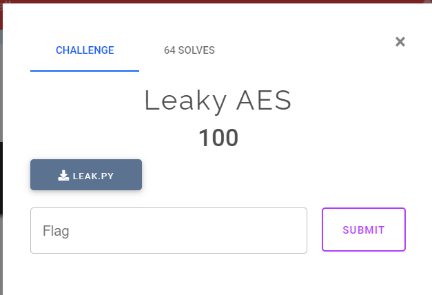

# **Leaky AES**
## **Câu hỏi**

## **Source:** [Leak.py](./src/Leak.py)

Đề này có sử dụng mã hóa AES dạng CTR. Đầu tiên, ta sẽ tìm hiểu cách CTR hoạt động như thế nào

### **Mã hóa:**

-   Khởi tạo nonce ngẫu nhiên, giá trị này sẽ kết hợp với counter.
-   Chia plaintext thành các block 16 byte.
-   Áp dụng mã hóa AES với counter và key. Kết quả của việc mã hóa trên sẽ XOR với plaintext block để ra được ciphertext
-   Cứ sau mỗi lần mã hóa như thế, biến counter sẽ tăng lên và áp dụng như thế cho các plaintext block tiếp theo.
-   Kết hợp các ciphertext block để ra ciphertext hoàn chỉnh

### **Giải mã:**

-   Hoàn toàn tương tự như mã hóa

## **Phân tích**
Có hai điều đáng lưu ý khi nhìn vào source code

-   Mình biết được một cặp plaintext-ciphertext
-   Sử dụng cùng key, counter của cặp plaintext-ciphertext cho việc mã hóa flag.

Do đó, ta sẽ gọi $P_i,C_i$ là cặp plaintext-ciphertext đã biết, $P_f, C_f$ là cặp plaintext-ciphertext của flag, K là key, T là counter để mã hóa.

Ta có:
$$C_i = P_i \ \oplus Enc(T,K)$$
$$C_f = P_f \ \oplus Enc(T,K)$$
Suy ra:
$$C_i\ \oplus C_f = P_i \ \oplus Enc(T,K)\ \oplus P_f \ \oplus Enc(T,K)$$
Do XOR có tính năng tự hủy với chính nó nên:
$$C_i\ \oplus C_f = P_i \ \oplus P_f$$
$$C_i\ \oplus C_f \ \oplus P_i = P_f$$
Như vậy, ta có thể tìm ra được flag bằng cách XOR `encrypted`, `encrypted2` và cụm `"TODO:... CHALLENGE\N"`

Đây là script để giải bài này: [dec.py](./script/dec.py)
## **Flag**
``ASCIS{Congratulate_and_W3lc0me_t0_ASIS_CRYPT0_chall}``