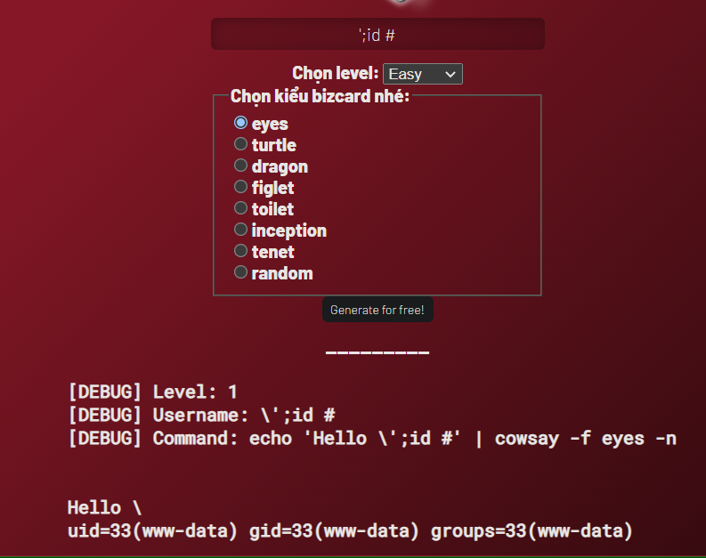

# Write-up 4IN1_BIZCARD_GENERATOR
Đây là write up của bài lab tiếp theo về chủ đề OS Command Injection của Cyberjutsu. Mọi người làm bài lab bằng cách dùng lệnh `docker-compose up --build` rồi truy cập vào localhost:5555 nhé.

Trước hết, chúng ta sẽ nói sơ qua về cách web này hoạt động

Chúng ta cần ba tham số đó là level, type, và username. Tham số username sẽ được xử lí thông qua hàm `validate_username` tùy vào level. Cuối cùng, web sẽ xử lí các lệnh `cowsay` khác nhau theo `type` mà ta chọn.
```php
switch($type){
    case 'eyes':
        $cowsay = <<<EOF
        echo 'Hello $username' | cowsay -f eyes -n 
        EOF;
        break;
    case 'turtle':
        $cowsay = <<<EOF
        echo 'Hello $username' | cowsay -f turtle -n 
        EOF;
        break;
    case 'dragon':
        $cowsay = <<<EOF
        echo 'Hello $username' | cowsay -f dragon -n 
        EOF;
        break;   
    case 'figlet':
        $cowsay = <<<EOF
        echo 'Hello $username' | cowsay -n ; figlet "Hello $username"
        EOF;
        break;
    case 'toilet':
        $cowsay = <<<EOF
        echo 'Hello $username' | cowsay -n ; toilet 'Hello $username'
        EOF;
        break;  
    case 'inception':
        $cowsay = <<<EOF
        echo 'Hello $username' | cowsay -n | cowthink -n
        EOF;
        break; 
    case 'tenet':
        $cowsay = <<<EOF
        echo 'Hello $username' | cowsay -n | cowthink -n | cowsay -n 
        EOF;
        break;              
    case 'random':
    default:
        $cowsay = <<<EOF
        fortune | cowsay -n | cowthink -n
        EOF;
}
```
Nhìn vào đoạn code trên, ta có thể nhận ra rằng web này có khả năng bị lỗ hổng OS Command Injection (chúng ta chỉ cần tìm cách thoát ra khỏi các cặp nháy là được). Tuy vậy, có khai thác được hay không thì cũng phụ thuộc vào cách tham số `username` được xử lí như thế nào.
## **Level 1**
```php
$input = addslashes($input);
```
Ở đây, biến input chỉ được xử lí qua hàm `addslashes`. Hàm này sẽ tự động thêm dấu `\` vào trước các kí tự cần escaped gồm có `\`, `'` và `"` (Nguồn: [addslashes](https://php.net/addslashes)). Tuy vậy, điều này cũng vô nghĩa do các kí tự ở giữa hai giữa dấu nháy đơn trong linux shell đều bị "vô hiệu hóa" tức là chỉ được xem như là kí tự bình thường kể cả dấu `\`. Do đó, chúng ta chỉ cần nhập ``';command #`` là ổn (nhớ là đừng chọn type random)

