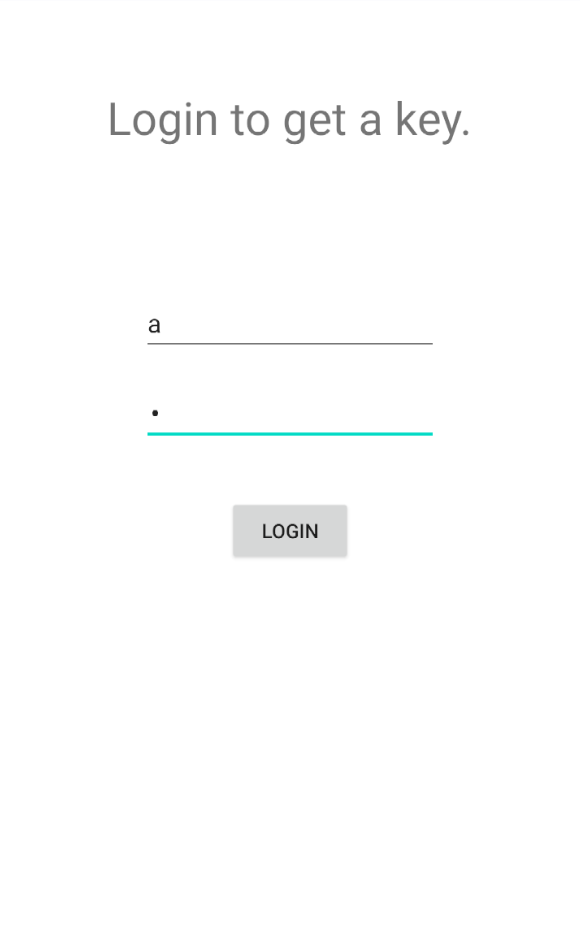
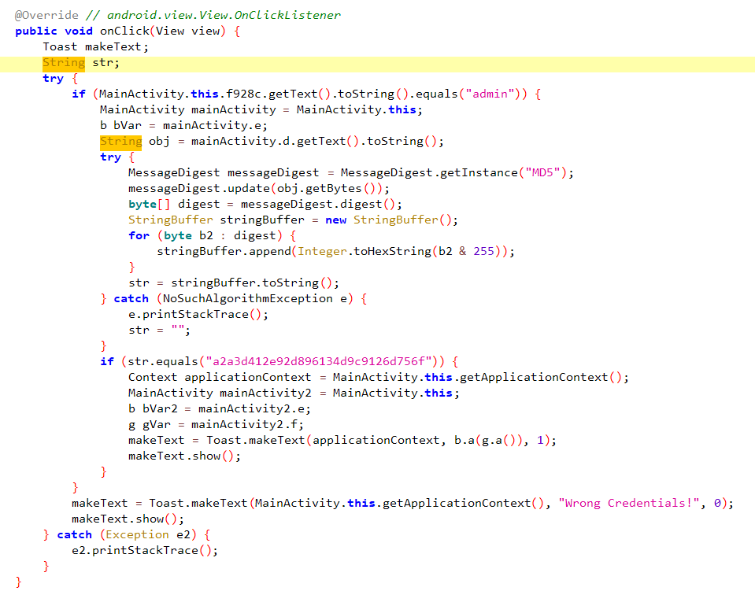
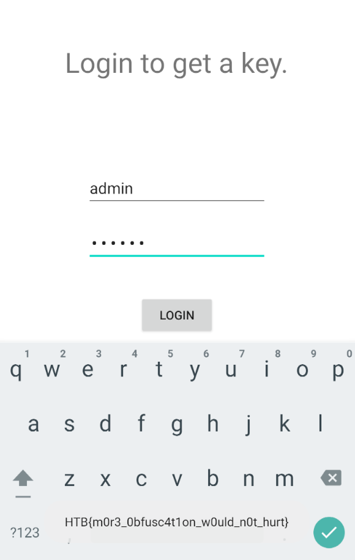

<div align='center'>

# **APKey**

</div>

## **1) Mô tả**

*This app contains some unique keys. Can you get one?*

## **2) Phân tích**

Ta có file `APKey.apk`, cài đặt vào máy. Chạy app thì thấy một form đăng nhập để lấy "key". Đăng nhập bằng tài khoản `admin` và mật khẩu `admin` thì app hiện thông báo "Wrong credentials" .  



Kiểm tra source code bằng jadx-gui thì ta thấy đoạn xử lý đăng nhập:



App sẽ kiểm tra thông tin của tên đăng nhập có phải là
admin không, nếu phải thì sẽ kiểm tra mật khẩu. Nếu dạng hash MD5 của mật khẩu là `a2a3d412e92d896134d9c9126d756f` thì app sẽ hiện "key" lên màn hình.

Mã hash MD5 này không thể giải mã ngược lại được, vì vậy ta sẽ tìm cách khác để lấy được mật khẩu.

## **3) Exploit**

Ta sẽ sử dụng frida để hook phương thức `equals()` của lớp `String` để nó luôn trả về true. Khi mà như thế thì việc so sánh mật khẩu nhập vào với mật khẩu trong code sẽ luôn trả về true. Ta sử dụng python script sau:

```python
import frida
import time

device = frida.get_usb_device()
pid = device.spawn("com.example.apkey")
device.resume(pid)

time.sleep(1)  # Without it Java.perform silently fails

session = device.attach(pid)

hook_script = """Java.perform(function() {
    var String = Java.use("java.lang.String");
    String.equals.overload("java.lang.Object").implementation = function(arg1) {
        return true;
    };
});"""


script = session.create_script(hook_script)
script.load()

input('Press any key to exit...')
```

Chạy đoạn script này sẽ mở app lên. Đăng nhập bằng tài khoản `admin` và mật khẩu bất kì thì app sẽ hiện "key" là flag lên màn hình.

