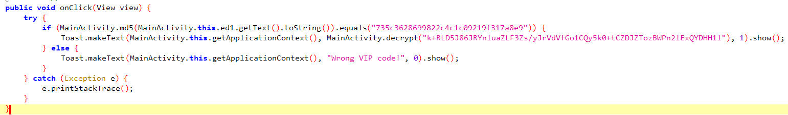
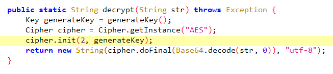
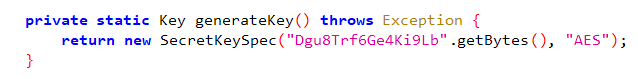
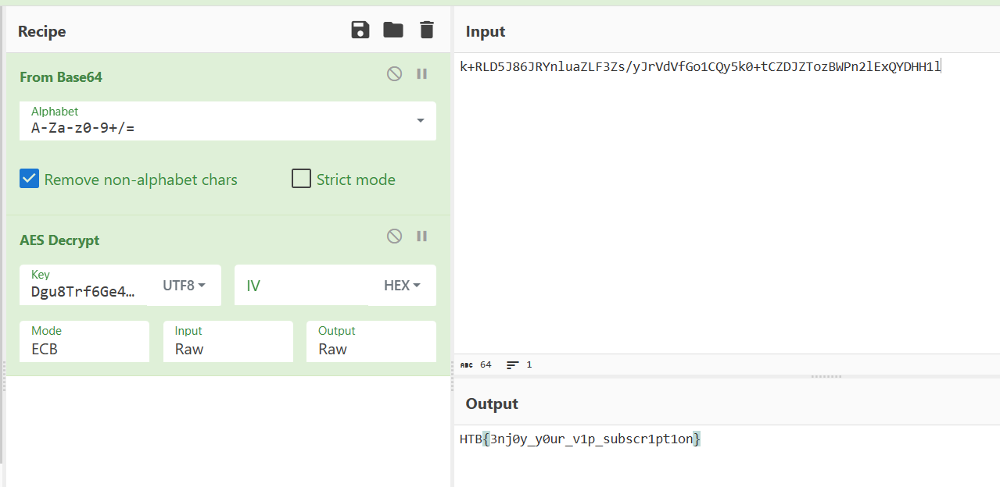

# **APKrypt**

## **0) Set up môi trường**

[Set up BurpSuite để đọc được request của app](https://github.com/lUcgryy/Android-Pentest-Note/blob/main/TestCurl.md)

## **1) Mô tả**

*Can you get the ticket without the VIP code?*

## **2) Phân tích**

Chúng ta được cấp file APKrypt.apk, cài nó vào điện thoại và mở app lên.

Chúng ta cần biết VIP code thì sẽ được "ticket", tuy nhiên chúng ta lại không biết VIP code. Decompile file apk bằng jadx để xem app xử lí như thế nào

Nhìn vào source code, ta thấy rằng app sẽ kiểm tra mã hash MD5 của VIP code có phải là `735c3628699822c4c1c09219f317a8e9` hay không. Nếu đúng thì sẽ thực hiện giải mã gì đó.

Với mã hash trên thì chúng ta không thể crack được, vì vậy, chúng ta sẽ tìm hiểu sâu và chức năng decrypt của app này (ta đã có chuỗi mã hóa: `k+RLD5J86JRYnluaZLF3Zs/yJrVdVfGo1CQy5k0+tCZDJZTozBWPn2lExQYDHH1l`). 

decrypt()

Ta thấy rằng app sẽ base64 decode chuỗi mã hóa trên, sau đó sẽ decrypt chuỗi đã được base64 decode bằng thuật toán AES. Để decrypt được chuỗi này, ta cần biết key. Hãy nhìn vào hàm `generateKey()`.

Ta thấy key là `Dgu8Trf6Ge4Ki9Lb`

Dùng [cyberchef](https://gchq.github.io/CyberChef/#recipe=From_Base64('A-Za-z0-9%2B/%3D',true,false)AES_Decrypt(%7B'option':'UTF8','string':'Dgu8Trf6Ge4Ki9Lb'%7D,%7B'option':'Hex','string':''%7D,'ECB','Raw','Raw',%7B'option':'Hex','string':''%7D,%7B'option':'Hex','string':''%7D)&input=aytSTEQ1Sjg2SlJZbmx1YVpMRjNacy95SnJWZFZmR28xQ1F5NWswK3RDWkRKWlRvekJXUG4ybEV4UVlESEgxbA) để giải mã chuỗi

