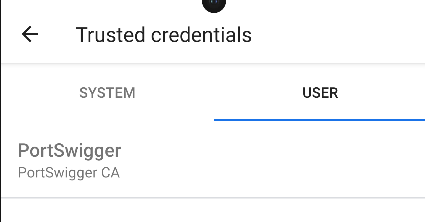

<div align='center'>

# **Anchored**

</div>

## **0) Set up môi trường**

[Set up BurpSuite để đọc được request của app](https://github.com/lUcgryy/Android-Pentest-Note/blob/main/TestCurl.md)

## **1) Mô tả**

*A client asked me to check if I can intercept the https request and get the value of the secret parameter that is passed along with the user's email. The application is intended to run in a non-rooted device. Can you help me find a way to intercept this value in plain text.*

## **2) Phân tích**

Chúng ta được cấp file Anchored.apk, cài nó vào điện thoại và mở app lên.


Điền email và bấm "Request Access", không thấy gì trên BurpSuite khi thử đọc request. Kiểm tra kĩ hơn thì phát hiện lỗi sau


Vậy app có sử dụng cơ chế SSL Pinning. Tuy nhiên, app chỉ áp dụng cho non-rooted device, ta không thể đơn giản sử dụng Frida để bypass SSL Pinning. 

Dựa vào tên thử thách, ta sẽ kiểm tra cấu hình của app qua file `AndroidManifest.xml` và ta thấy cấu hình bảo mật mạng


Dựa vào đó, ta biết file cấu hình này ở `res/xml/network_security_config.xml`. Mở file này lên

```xml
<?xml version="1.0" encoding="utf-8"?>
<network-security-config>
    <domain-config cleartextTrafficPermitted="false">
        <domain includeSubdomains="true">anchored.com
        </domain>
        <trust-anchors>
            <certificates src="@raw/certificate"/>
        </trust-anchors>
    </domain-config>
</network-security-config>
```

Ta thấy app chỉ cho phép giao tiếp với domain `anchored.com` và chỉ tin tưởng vào certificate được lưu ở `res/raw/certificate`. Ta sẽ patch file này để app tin tưởng vào certificate của BurpSuite.

Đầu tiên, cài đặt BurpSuite certificate vào điện thoại (https://blog.ropnop.com/configuring-burp-suite-with-android-nougat)



Đầu tiên, sử dụng apktool để decompile file apk

```bash
apktool d Anchored.apk
```

Sửa lại file `network_security_config.xml` như sau

```xml
<?xml version="1.0" encoding="utf-8"?>
<network-security-config>
    <domain-config cleartextTrafficPermitted="false">
        <domain includeSubdomains="true">anchored.com</domain>
        <trust-anchors>
            <certificates src="user" overridePins="true" />
        </trust-anchors>
    </domain-config>
</network-security-config>
```

Ta đã thay đổi để app tin tưởng vào certificate add bởi user, overridePins để bỏ qua SSL Pinning.

Build lại file apk

```bash
apktool b Anchored
```

Sign lại file apk

```bash
keytool -genkey -v -keystore my-release-key.keystore -alias alias_name -keyalg RSA -keysize 2048 -validity 10000
jarsigner -verbose -sigalg SHA1withRSA -digestalg SHA1 -keystore my-release-key.keystore Anchored.apk alias_name
```

Cài đặt file apk mới vào điện thoại và thử lại. Ta sẽ thấy request được gửi lên BurpSuite chứa flag

