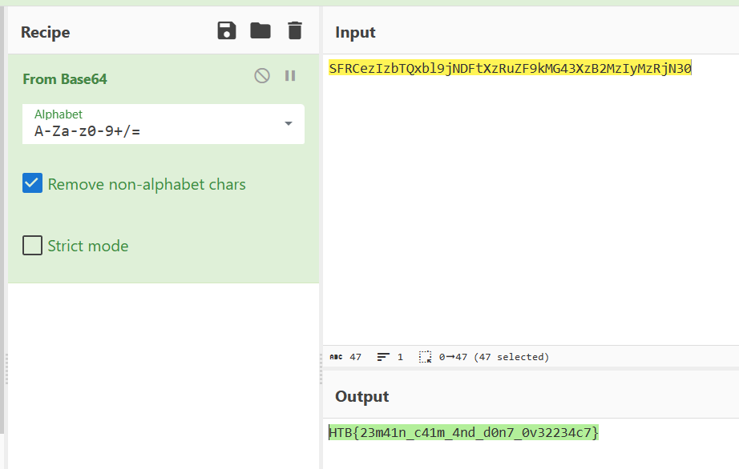

# **Don't Overreact**

## **1) Mô tả**

*Some web developers wrote this fancy new app! It's really cool, isn't it?*

## **2) Phân tích**

Ta có file `app-release.apk`, cài đặt vào máy. Chạy app thì ta chỉ thấy logo htb

Kiểm tra source code bằng jadx-gui thì ta thấy app sử dụng React Native:

Đối với React Native app, đoạn code của app thường nằm ở file `index.android.bundle` trong thư mục `assets`. 

Đây là một file bundle của React Native app. Kiểm tra file này, ta thấy flag dưới dạng base64:

