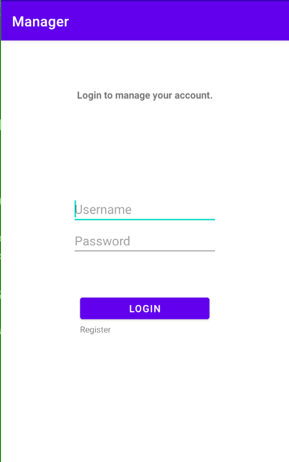

# **Manager**

## **0) Set up môi trường**

[Set up BurpSuite để đọc được request của app](https://github.com/lUcgryy/Android-Pentest-Note/blob/main/TestCurl.md)

## **1) Mô tả**

*A client asked me to perform security assessment on this password management application. Can you help me?*

## **2) Phân tích**

Chúng ta được cấp file Manage.apk, cài nó vào điện thoại và mở app lên. Chúng ta thấy được một màn hình login như sau:

Login với username là `admin` và password là `admin` thì app thông báo "User not found"

Nhìn qua BurpSuite thì thấy app gửi POST request tới "http://IP:PORT/login.php"

Ở màn hình login, ta thấy có tính năng Đăng kí. Thử đăng kí với username là `admin` và password là `admin` thì app thông báo "Username already taken". Điều đó có nghĩa là tồn tại một user có username là `admin`

Nhìn qua BurpSuite thì thấy app gửi POST request tới "http://IP:PORT/register.php"

Hãy đăng kí tài khoản bình thường `lUcgryy:123456`. Đăng ký thành công, ta sẽ thấy một màn hình quản lý mật khẩu

Đổi mật khẩu thành `1234567`, ta thấy app gửi POST request tới "http://IP:PORT/manage.php"

Request này không có áp dụng cơ chế session hay token nào để xác thực danh tính user, điều đó có nghĩa là ta có thể thay đổi mật khẩu của user khác. Thay đổi mật khẩu của user `admin` thành `123456`, ta thấy request thành công

Thử đăng nhập với username là `admin` và password là `123456`, ta đăng nhập thành công và thấy được flag

