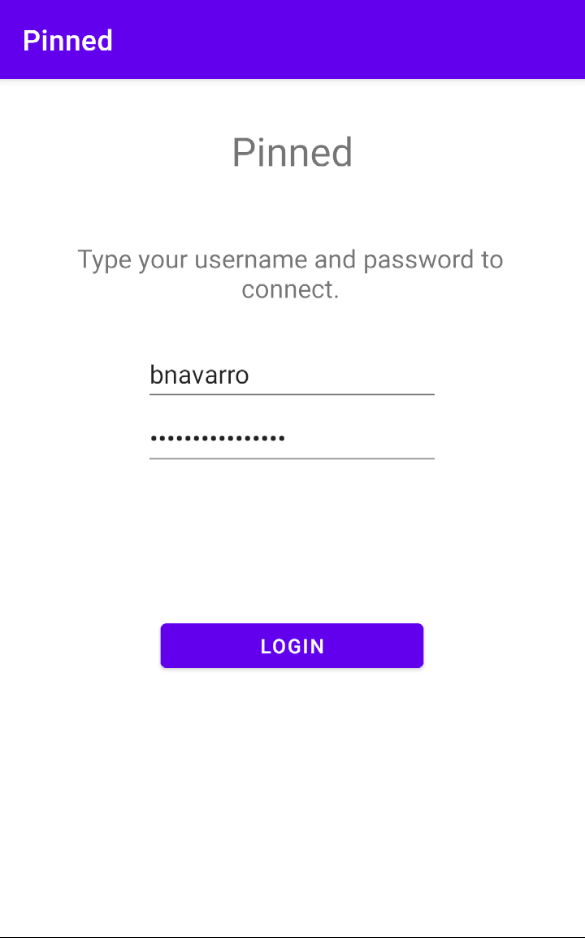
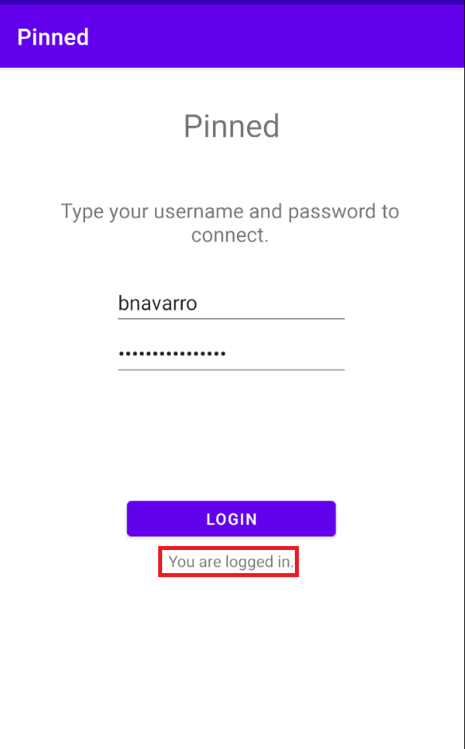
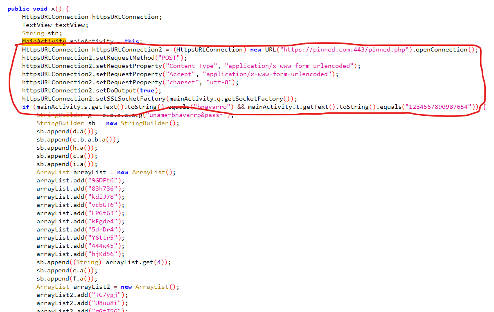
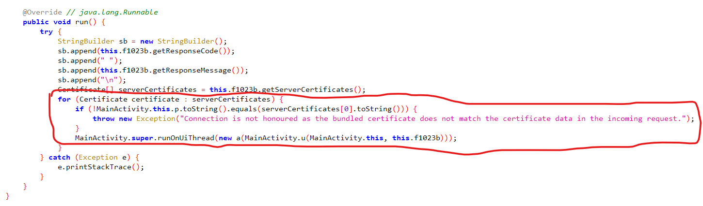
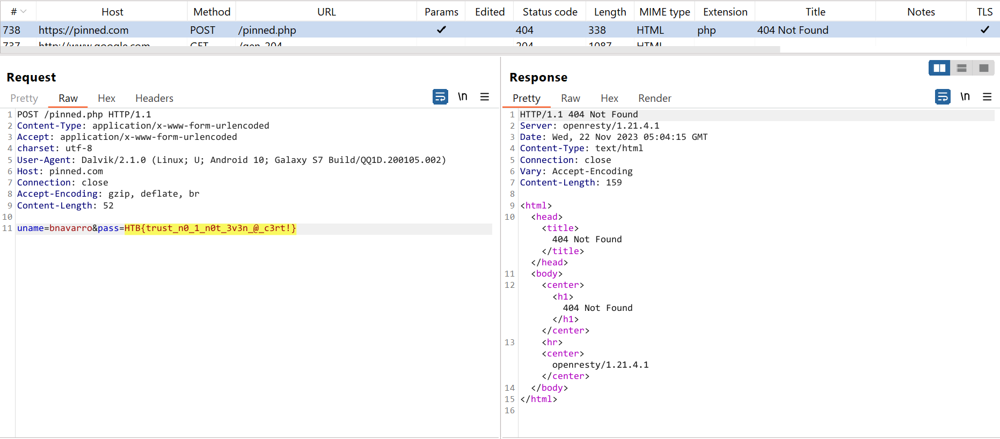
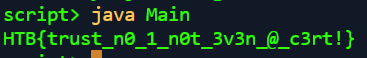

<div align='center'>

# **Pinned**

</div>

## **1) Mô tả**

*This app has stored my credentials and I can only login automatically. I tried to intercept the login request and restore my password, but this seems to be a secure connection. Can you help bypass this security restriction and intercept the password in plaintext?*

## **2) Phân tích**

Chúng ta được cấp file Pinned.apk. Cài nó vào điện thoại và mở app lên. Chúng ta thấy được một màn hình login như sau:



Màn hình login này có username là bnavarro và password có sẵn. Bấm vào nút Login thì hiện thông báo "You are logged in"



Decompile file apk bằng jadx, ta thấy rằng khi nút Login được bấm, app sẽ kiểm tra credential có phải là `bnavarro:1234567890987654`, nếu đúng thì app sẽ gửi POST request tới "https://pinned.com:443/pinned.php"

 

Tuy vậy app sẽ gửi request body là `uname=bnavarro&pass=<sb>` với sb được xử lí bởi các dòng code dưới đây:

```java
StringBuilder g = c.a.a.a.a.g("uname=bnavarro&pass=");
StringBuilder sb = new StringBuilder();
sb.append(d.a());
sb.append(c.b.a.b.a());
sb.append(h.a());
sb.append(c.a());
sb.append(i.a());
ArrayList arrayList = new ArrayList();
arrayList.add("9GDFt6");
arrayList.add("83h736");
arrayList.add("kdiJ78");
arrayList.add("vcbGT6");
arrayList.add("LPGt63");
arrayList.add("kFgde4");
arrayList.add("5drDr4");
arrayList.add("Y6ttr5");
arrayList.add("444w45");
arrayList.add("hjKd56");
sb.append((String) arrayList.get(4));
sb.append(e.a());
sb.append(f.a());
ArrayList arrayList2 = new ArrayList();
arrayList2.add("TG7ygj");
arrayList2.add("U8uu8i");
arrayList2.add("gGtT56");
arrayList2.add("84hYDG");
arrayList2.add("yRCYDm");
arrayList2.add("7ytr4E");
arrayList2.add("j5jU87");
arrayList2.add("yRCYDm");
arrayList2.add("jd9Idu");
arrayList2.add("kd546G");
sb.append((String) arrayList2.get(7));
sb.append(c.b.a.a.a());
String sb2 = sb.toString();
char charAt = b.q.h.b().charAt(3);
char charAt2 = b.q.h.b().charAt(0);
char charAt3 = c.a().charAt(0);
char charAt4 = c.b.a.a.a().charAt(8);
char charAt5 = h.a().charAt(1);
char charAt6 = b.q.h.b().charAt(0);
char charAt7 = i.a().charAt(5);
char charAt8 = c.b.a.a.a().charAt(7);
char charAt9 = c.b.a.b.a().charAt(4);
httpsURLConnection = httpsURLConnection2;
char charAt10 = e.a().charAt(4);
char charAt11 = e.a().charAt(4);
char charAt12 = i.a().charAt(5);
char charAt13 = d.a().charAt(3);
char charAt14 = d.a().charAt(5);
char charAt15 = h.a().charAt(1);
char charAt16 = h.a().charAt(1);
SecretKeySpec secretKeySpec = new SecretKeySpec((String.valueOf(charAt) + String.valueOf(charAt2) + String.valueOf(charAt3) + String.valueOf(charAt4).toUpperCase() + String.valueOf(charAt5) + String.valueOf(charAt6) + String.valueOf(charAt7).toUpperCase() + String.valueOf(charAt8) + String.valueOf(charAt9) + String.valueOf(charAt10) + String.valueOf(charAt11) + String.valueOf(charAt12).toUpperCase() + String.valueOf(charAt13) + String.valueOf(charAt14) + String.valueOf(charAt15) + String.valueOf(charAt16)).getBytes(), g.a());
Cipher cipher = Cipher.getInstance(g.a());
cipher.init(2, secretKeySpec);
g.append(new String(cipher.doFinal(Base64.decode(sb2, 0)), "utf-8"));
```

Vậy nhiệm vụ của ta là tìm ra được nội dung của mật khẩu sẽ gửi request lên server. Ta sẽ làm theo hai cách: đọc được POST request trên BurpSuite hoặc thử giải mã mật khẩu trong source code.

## **3) Đọc POST request**

Đầu tiên, ta sẽ [Set up BurpSuite để đọc được request của app](https://github.com/lUcgryy/Android-Pentest-Note/blob/main/TestCurl.md)

Sau khi set up xong, thử login lại thì không có gì xảy ra hết. Kiểm tra thì app có kiểm tra certificate-pinning



Thử bypass bằng frida với đoạn script trên mạng: [Universal Android SSL Pinning Bypass 2](https://codeshare.frida.re/@sowdust/universal-android-ssl-pinning-bypass-2/)

Đây là frida script [frida_script.py](./script/frida_script.py)

Chạy script trên, sau đó login lại thì BurpSuite đã bắt được request chứa mật khẩu là flag



## **4) Giải mã mật khẩu trong source code**

Nhớ lại đoạn code xử lí mật khẩu ở trên, sau khi deobfuscate bằng cách trace tới các method, ta có đoạn code sau:

```java
String ct = "zlg4rjdEd0Xvwel80q98Cc1Z1TPpCsLPGt63lw+sVsk3ED9ayRCYDmfQn/gdiEvh";
String key = "u29ve2sEXVVs4jee";
char charAt = key.charAt(0);
char charAt2 = key.charAt(1);
char charAt3 = key.charAt(2);
char charAt4 = key.charAt(3);
char charAt5 = key.charAt(4);
char charAt6 = key.charAt(5);
char charAt7 = key.charAt(6);
char charAt8 = key.charAt(7);
char charAt9 = key.charAt(8);
char charAt10 = key.charAt(9);
char charAt11 = key.charAt(10);
char charAt12 = key.charAt(11);
char charAt13 = key.charAt(12);
char charAt14 = key.charAt(13);
char charAt15 = key.charAt(14);
char charAt16 = key.charAt(15);
SecretKeySpec secretKeySpec = new SecretKeySpec((String.valueOf(charAt) + String.valueOf(charAt2) + String.valueOf(charAt3) + String.valueOf(charAt4).toUpperCase() + String.valueOf(charAt5) + String.valueOf(charAt6) + String.valueOf(charAt7).toUpperCase() + String.valueOf(charAt8) + String.valueOf(charAt9) + String.valueOf(charAt10) + String.valueOf(charAt11) + String.valueOf(charAt12).toUpperCase() + String.valueOf(charAt13) + String.valueOf(charAt14) + String.valueOf(charAt15) + String.valueOf(charAt16)).getBytes(), "AES");
Cipher cipher = Cipher.getInstance("AES");
cipher.init(2, secretKeySpec); 
byte[] decode = Base64.getDecoder().decode(ct);
byte[] doFinal = cipher.doFinal(decode);
System.out.println(new String(doFinal, "UTF-8"));
```

App sẽ giải mã mật khẩu bằng thuật toán AES với key là `u29ve2sEXVVs4jee`. Sau khi chạy code, ta được mật khẩu là flag

