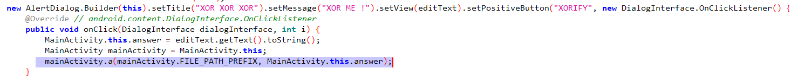

<div align='center'>

# **SAW**

</div>

## **1) Mô tả**

*The malware forensics lab identified a new technique for hiding and executing code dynamically. A sample that seems to use this technique has just arrived in their queue. Can you help them?*

## **2) Phân tích**

Ta có file `SAW.apk`, cài đặt vào máy. Tuy nhiên, khi bấm vào app thì nó không chạy. Hãy kiểm tra source code bằng jadx-gui


Ta thấy có một đoạn check liên quan đến `getIntent().getExtras()` để kiểm tra giá trị từ intent mà đã lưu trữ trong bundle. Cụ thể là app sẽ kiểm tra giá trị của trường `open` có phải là `sesame` hay không, nếu phải thì có thể app sẽ xuất hiện

Ta sẽ dùng Activity Manager (am) để bypass check này

```bash
am start -n com.stego.saw/.MainActivity --es open sesame
```


Bấm vào `Click me` thì app lại đóng. Ta sẽ dùng `adb logcat` để xem log thì phát hiện lỗi sau: `Unable to add window android.view.ViewRootImpl$W@e55c76b -- permission denied for window type 2038`


Sau một lúc tìm hiểu thì ta biết được rằng, app này yêu cầu quyền `SYSTEM_ALERT_WINDOW` để có thể hiển thị một view lên trên các app khác. Dựa vào [đây](https://stackoverflow.com/questions/63654783/android-permission-denied-for-window-type-2038) ta sẽ cấp thêm quyền "Display over other apps" cho app này trong phần settings


Chạy lai app và bấm vào `Click me` thì ta thấy một popup hiện lên


Nhập vào chuỗi bất kì thì không có gì xảy ra. Lại kiểm tra source code



Có vẻ app sử dụng `mainActivity.a()` để kiểm tra chuỗi nhập vào. Ta thấy đó là native method và nó được load từ file `libnative-lib.so` và `libdefault.so`.


Sử dụng `apktool` để decompile file apk và lấy được file `libnative-lib.so` và `libdefault.so`. Load vào IDA để decomplie.

Ta thấy method a():


Ta thấy `a()` gọi `_Z1aP7_JNIEnvP8_1()` và hàm này gọi `_Z17_Z1aP7_JNIEnvP8_1PKcS0_()`


Dùng frida để debug app và hook hàm `_Z17_Z1aP7_JNIEnvP8_1PKcS0_()` để xem các tham số truyền vào: [hook_script.js](./script/hook_script.js)


Ta thấy tham số đầu tiên là một đường dẫn, tham số thứ 2 là chuỗi nhập vào. Kiểm tra code của hàm này trong IDA


Ta thấy có một bước kiểm tra bằng cách thực hiện phép xor giữa chuỗi l với input mình nhập vào (a2), nếu nó là chuỗi m thì làm các bước tiếp theo


Đây là giá trị của l và m


Sau đó hàm này thực hiện các thao tác gì đó rồi mở file với đường dẫn là tham số đầu tiên (src, cụ thể hơn là `/data/user/0/com.stego.saw/`) qua `fopen()`, ghi gì đó vào file đó rồi đóng file lại.

## **3) Exploit**

Ta sẽ vượt qua đoạn check đầu tiên bằng cách xor l với m qua đoạn script này

```python
def xor(b1, b2):
    return bytes([a ^ b for a, b in zip(b1, b2)])
l = b"\x0A\x0B\x18\x0F\x5E\x31\x0C\x0F"
m = b"\x6C\x67\x28\x6E\x2A\x58\x62\x68"

print(xor(l, m))
```

Kết qủa là `fl0ating` 


Chạy lại app và nhập `fl0ating`. Kiểm tra đường dẫn `/data/user/0/com.stego.saw/` thì ta thấy có một file `h` kì lạ. Mở file này lên thì ta thấy flag

