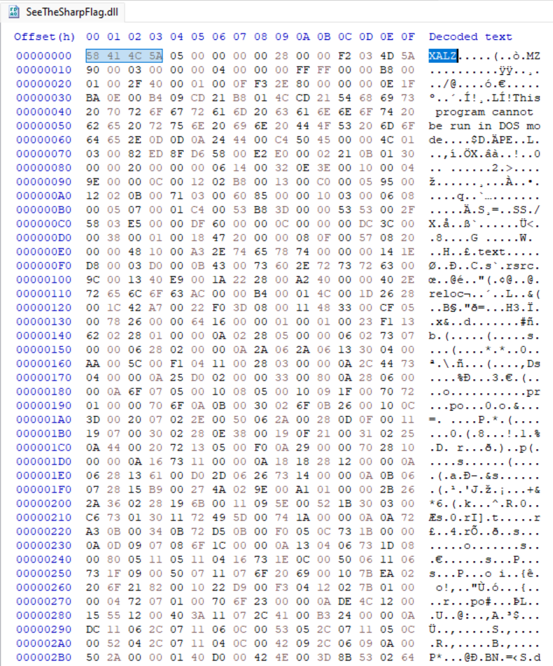

<div align='center'>

# **SeeTheSharpFlag**

</div>

## **0. Set up môi trường**

[Set up BurpSuite để đọc được request của app](https://github.com/lUcgryy/Android-Pentest-Note/blob/main/TestCurl.md)

## **1. Mô tả**

*I have made a password verification app. If I can remember the password, the app will tell me it is correct. See if you can guess my password.*

## **2. Phân tích**

Chúng ta được cấp file SeeTheSharpFlag.apk, cài nó vào điện thoại và mở app lên.


App cho phép ta điền secret và bấm nút "Click on me". App sẽ kiểm tra secret nhập vào có đúng hay không


Decompile source code file apk bằng jadx, ta thấy rằng app có sử dụng xamarin để tạo ra app này. [Xamarin](https://learn.microsoft.com/en-us/xamarin/) là nền tảng cho phép viết app bằng C# và chạy trên nhiều nền tảng khác nhau.


Decompile bằng apktool

```bash
apktool d SeeTheSharpFlag.apk
```

Ta thấy rất nhiều dll file trong thư mục `unknown/assemblies`


Ta thấy 2 dll thú vị `SeeTheSharpFlag.Android.dll` và `SeeTheSharpFlag.dll`. Thử decompile 2 file này bằng [dnSpy](https://github.com/dnSpy/dnSpy) nhưng không thành công


Có thể đây không phải là file dll bình thường, điều tra bằng HxD



Ta thấy phần file signature là XALZ, nghiên cứu một chút thì đây là cơ chế nén file lz4 của xamarin. Ta sẽ sử dụng [tool](https://github.com/NickstaDB/xamarin-decompress) này để giải nén file dll

```bash
python xamarin-decompress.py SeeTheSharpFlag.dll
```

Sử dụng lại dnSpy, ta đã decompile thành công.


Lướt qua source code, ta thấy đoạn code để kiểm tra secret


Dựa vào [tài liệu]([https://docs.microsoft.com/en-us/xamarin/android/deploy-test/release-prep/?tabs=windows#proguard) này, app sẽ sử dụng AES để giải mã chuỗi `sjAbajc4sWMUn6CHJBSfQ39p2fNg2trMVQ/MmTB5mno=` sau khi đã decode base64 với key là `6F+WgzEp5QXodJV+iTli4Q==` sau khi đã decode base64 và iv là `6F+WgzEp5QXodJV+iTli4Q==` sau khi đã decode base64.

Sử dụng [cyberchef](https://gchq.github.io/CyberChef/#recipe=From_Base64('A-Za-z0-9%2B/%3D',true,false)AES_Decrypt(%7B'option':'Base64','string':'6F%2BWgzEp5QXodJV%2BiTli4Q%3D%3D'%7D,%7B'option':'Base64','string':'DZ6YdaWJlZav26VmEEQ31A%3D%3D'%7D,'CBC','Raw','Raw',%7B'option':'Hex','string':''%7D,%7B'option':'Hex','string':''%7D)&input=c2pBYmFqYzRzV01VbjZDSEpCU2ZRMzlwMmZOZzJ0ck1WUS9NbVRCNW1ubz0) để giải mã chuỗi 

