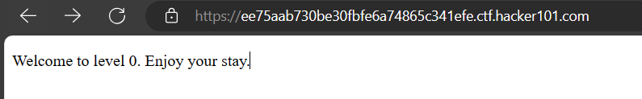
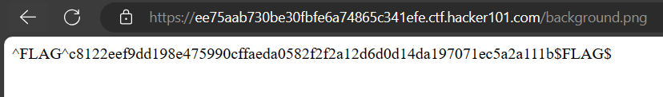

<div align='center'>

# **A little something to get you started**

</div>

Giao diện website



Xem source page ta thấy xuất hiện một file `background.`

```html
<!doctype html>
<html>
    <head>
        <style>
            body {
                background-image: url("background.png");
            }
        </style>
    </head>
    <body>
        <p>Welcome to level 0.  Enjoy your stay.</p>
    </body>
</html>
```

Truy cập vào file `background.png` ta thấy được flag



```
^FLAG^c8122eef9dd198e475990cffaeda0582f2f2a12d6d0d14da197071ec5a2a111b$FLAG$
```