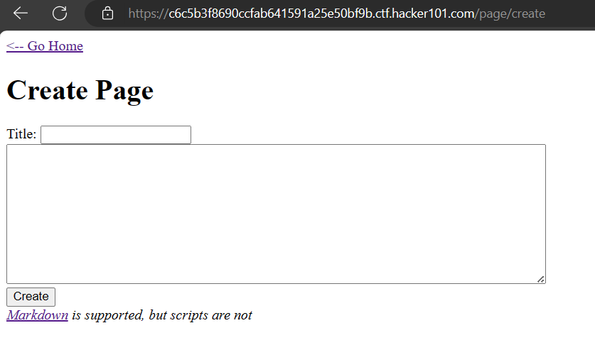

<div align='center'>

# **Micro-CMS v1**

</div>

Giao diện website


Flag 1: IDOR

Trang web có tính năng xem bài viết được viết dưới dạng markdown (đường dẫn `/page/{id}`)


Thử thay đổi id=4 thì ta thấy một respond nhìn khả nghi. Có vẻ như ta không có quyền đọc bài viết này.


Trang web có thêm tính năng chỉnh sửa bài viết (đường dẫn `/page/edit/1`). Đường dẫn này cấu trúc tương tự như `/page/{id}`


Tiếp tục thử đổi id=4 thì ta đã thấy được bài viết mà đáng lẽ ra không được phép đọc như ở tính năng xem bài viết trên. Bài viết này chứa flag.


```
^FLAG^01ad6f13ea34748c17718e57908aba0cd02bac5579a00a849dc9d1dcab0a5b1c$FLAG$
```

Flag 2: SQL Injection

Với cấu trúc đường dẫn `/page/{id}` thì ta có thể thử cho lỗi SQL Injection. Thử đổi `id=1'` thì ta thấy một respond chứa flag ở đường dẫn `/page/edit/1'`.


```
^FLAG^9d79f41c166295b02f4ab092ac653242fc819b29b73b0befe60eb45c55a734c7$FLAG$
```

Flag 3: XSS ở `Title` của bài viết

Ở trang tạo bài viết (`/page/create`) cho phép ta nhập title và content của bài viết. Ta được sử dụng Markdown và có vẻ như tag `<script>` ta không được phép sử dụng



Ngôn ngữ Markdown có thể sử dụng HTML nên ta sẽ sử dụng tag `<script>` cho cả title và nội dung của bài viết để xem có thực sự kiểm tra hết không


Xem lại bài, ta thấy rằng phần chỉ phần nội dung tag `<script>` bị xóa với lại không có bất kì lệnh javascript nào chạy.


Tuy nhiên khi quay lại `/` ta lại thấy popup hiện lên chứa flag. Có lẽ đoạn javascript của phần title đã được chạy ở đường dẫn này và dẫn đến lỗi XSS


```
^FLAG^33d1e6c8bfff75932fe1ea15d54393d4bae4e28a1462a88529908d478b4ddd53$FLAG$
```

Flag 4: XSS ở phần nội dung của bài viết

Bypass tag `<script>` bằng payload ``. Event `onerror` sẽ được chạy khi hình ảnh không được load thành công. Do `src` của hình ảnh là `x`  không tồn tại nên hình ảnh sẽ không được load thành công và event `onerror` sẽ được chạy.


Xem phần page source của bài viết vừa mới tạo ta thấy nội dung FLAG


```
^FLAG^03d01dfa2b228d10f7cd37f5893046f6edb29434bf21451a87bef40a1e0477c3$FLAG$
```