<div align='center'>

# **Write up PwnSec CTF 2024: Snake**

</div>

## **Challenge file:** [snake.apk](./chal/snake.apk)

## **Summary**

1. Decompiling the application, realizing that the app use root and frida detection
2. Bypassing root and frida detection
3. Use frida to initialize the `BigBoss` class with the string `Snaaaaaaaaaaaaaake` to retrive the flag

## **Decompiling the application**

Loading the app to jadx. We can see that it check the rooted device by using the method `isDeviceRooted(Context context)` with various checking method

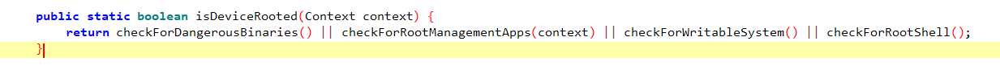

Let see how it is used

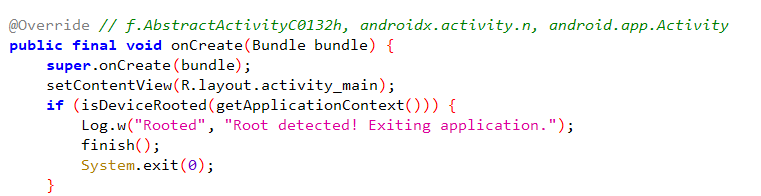

So if the device is rooted, the application will be exited. Therefore, we will use this frida script to bypass this check

```javascript
Java.perform(function() {

    let MainActivity = Java.use("com.pwnsec.snake.MainActivity");
        MainActivity["isDeviceRooted"].implementation = function (context) {
            console.log(`MainActivity.isDeviceRooted is called: context=${context}`);
            return false;
        };

})
```

This script will hook that method `isDeviceRooted(Context context)` and make this method return `false` no matter what, thus will bypass the above check

Assume that we bypassed root detection, what will we do next? Looking further, we can see the class `BigBoss`, let's look into that.

## **The BigBoss class**

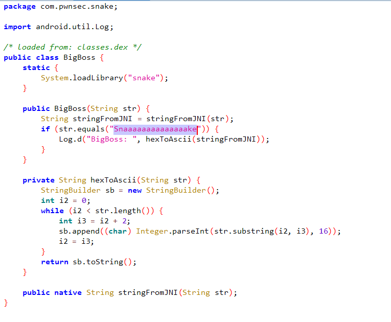

The constructor will call the `stringFromJNI` method from native library `libsnake.so`. If the string passed to it equal to `Snaaaaaaaaaaaaaake`, the app will print out result of the method `stringFromJNI` which is the flag to the log. Let's look into the `libsnake.so` using IDA

## **Native function and frida detection bypass**

The `stringFromJNI` method will map to the function `Java_com_pwnsec_snake_BigBoss_stringFromJNI` in native library

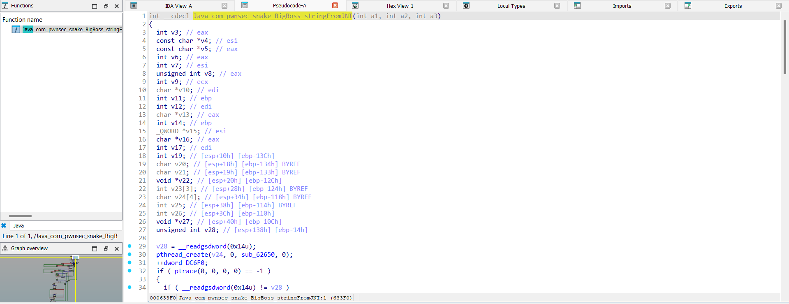

Deeping down into the function, firstly, it implement two ways of detection frida

1. It creates a new thread and perform frida detection on this

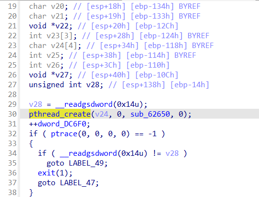

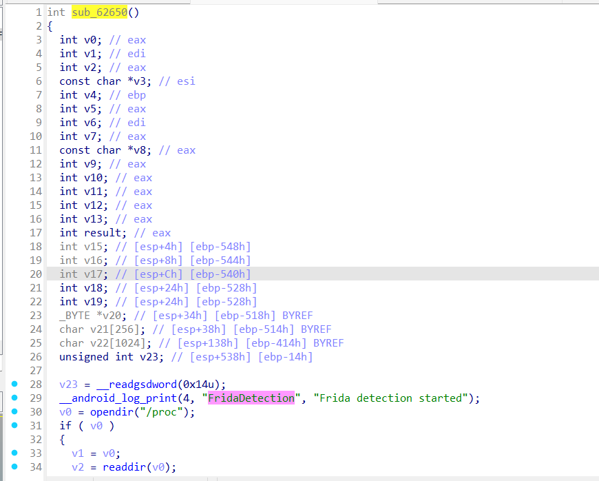

This can be bypassed using this frida script

```javascript
function hook_pthread_create(){
    var pt_create_func = Module.findExportByName(null,'pthread_create');
    var detect_frida_loop_addr = null;
    console.log('pt_create_func:',pt_create_func);
 
   Interceptor.attach(pt_create_func,{
       onEnter:function(arg){
        console.log(arg[2]);
           if(detect_frida_loop_addr == null)
           {
                var base_addr = Module.getBaseAddress('libsnake.so');
                detect_frida_loop_addr = base_addr.add(0x0000000000062650)
                console.log(base_addr)
                console.log(detect_frida_loop_addr)
                if(base_addr != null){
                    
                    console.log('this.context.eax: ', detect_frida_loop_addr , this.context.eax);
                    if(this.context.eax.compare(detect_frida_loop_addr) == 0) {
                        hook_anti_frida_replace(this.context.eax);
                    }
                }
 
           }
 
       },
       onLeave : function(retval){
           console.log('retval',retval);
       }
   })
}
function hook_anti_frida_replace(addr){
    console.log('replace anti_addr :',addr);
    Interceptor.replace(addr,new NativeCallback(function(a1){
        console.log('replace success');
        return;
    },'pointer',[]));
 
}

hook_pthread_create();

\\ Ref: https://github.com/xiaokanghub/Android?tab=readme-ov-file#bypass-frida-detection
```

This script will hook the function `pthread_create`, if the function the thread try to execute is frida checking (which is the `sub_62650` for my case) located at the address 0x62560 from the base address of `libsnake.so` when the app loaded to the memory, that frida check function will be replaced by new native function which do mostly nothing. Therefore, the frida dection check should never execute.

2. It's also implemented various frida dectection methods by opening different files and then checking if some frida-related strings are in those files using `strstr` function

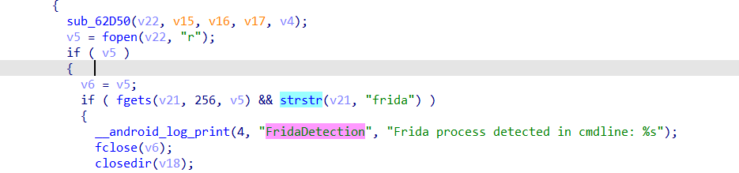

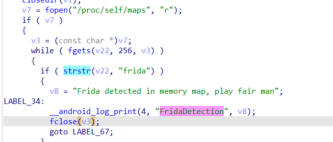

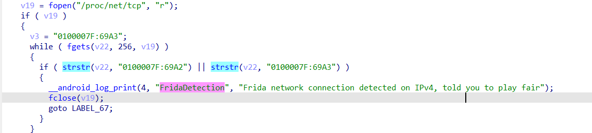

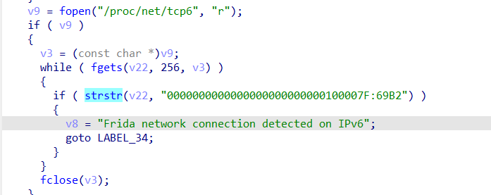

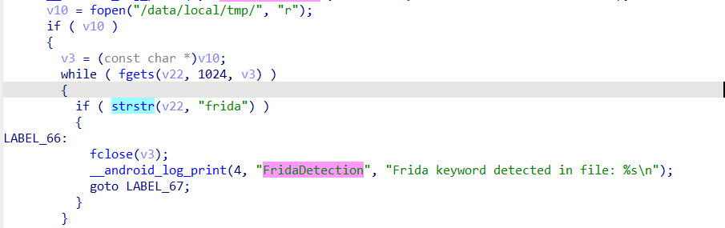

We will hook the `strstr` like below 

```javascript
Interceptor.attach(Module.findExportByName("libc.so", "strstr"), {
            onEnter: function(args) {
                console.log("strstr attached onEnter...");
                var arg_2 = Memory.readCString(ptr(args[1])).toString();
                console.log(`strstr(${Memory.readCString(ptr(args[0]))})`);
                console.log(`strstr(${arg_2})`);
                if (arg_2 == "frida" || arg_2.includes(":69")) {
                    frida = 1;
                }
            },
            onLeave: function(ret) {
                if (frida == 1) {
                    ret.replace(0);
                }
                console.log(`strstr attached onLeave... -> ${ret}`);
                frida = 0
            }
        })
```

Note that we only change the return value to `0` (`null`) only if the "needle" (second argument) to the "frida-related" string as this will not break the application normal functionality. As a result, we are successfully use frida to bypass frida detection :>

## **Conclusion**

Here is the final frida script


```javascript

setImmediate(
    Java.perform(function() {
        let MainActivity = Java.use("com.pwnsec.snake.MainActivity");
        MainActivity["isDeviceRooted"].implementation = function (context) {
            console.log(`MainActivity.isDeviceRooted is called: context=${context}`);
            let BigBoss = Java.use("com.pwnsec.snake.BigBoss"); // We force the app to initialize this class as the app itself does not call it 
            BigBoss["stringFromJNI"].implementation = function (str) {
                console.log(`BigBoss.stringFromJNI is called: str=${str}`);
                let result = this["stringFromJNI"](str); 
                console.log(`BigBoss.stringFromJNI result=${result}`);
                return result;
            };
            var bb = BigBoss.$new("Snaaaaaaaaaaaaaake");
            return false;
        };
        
        var frida = 0;
        Interceptor.attach(Module.findExportByName("libc.so", "strstr"), {
            onEnter: function(args) {
                console.log("strstr attached onEnter...");
                var arg_2 = Memory.readCString(ptr(args[1])).toString();
                console.log(`strstr(${Memory.readCString(ptr(args[0]))})`);
                console.log(`strstr(${arg_2})`);
                if (arg_2 == "frida" || arg_2.includes(":69")) {
                    frida = 1;
                }
            },
            onLeave: function(ret) {
                if (frida == 1) {
                    ret.replace(0);
                }
                console.log(`strstr attached onLeave... -> ${ret}`);
                frida = 0
            }
        })
    })
)
```

```javascript
function hook_pthread_create(){
    var pt_create_func = Module.findExportByName(null,'pthread_create');
    var detect_frida_loop_addr = null;
    console.log('pt_create_func:',pt_create_func);
 
   Interceptor.attach(pt_create_func,{
       onEnter:function(arg){
        console.log(arg[2]);
           if(detect_frida_loop_addr == null)
           {
                var base_addr = Module.getBaseAddress('libsnake.so');
                detect_frida_loop_addr = base_addr.add(0x0000000000062650)
                console.log(base_addr)
                console.log(detect_frida_loop_addr)
                if(base_addr != null){
                    
                    console.log('this.context.eax: ', detect_frida_loop_addr , this.context.eax);
                    if(this.context.eax.compare(detect_frida_loop_addr) == 0) {
                        hook_anti_frida_replace(this.context.eax);
                    }
                }
 
           }
 
       },
       onLeave : function(retval){
           console.log('retval',retval);
       }
   })
}
function hook_anti_frida_replace(addr){
    console.log('replace anti_addr :',addr);
    Interceptor.replace(addr,new NativeCallback(function(a1){
        console.log('replace success');
        return;
    },'pointer',[]));
 
}

hook_pthread_create();    
```

Load the app with those frida scripts and check logcat for the flag

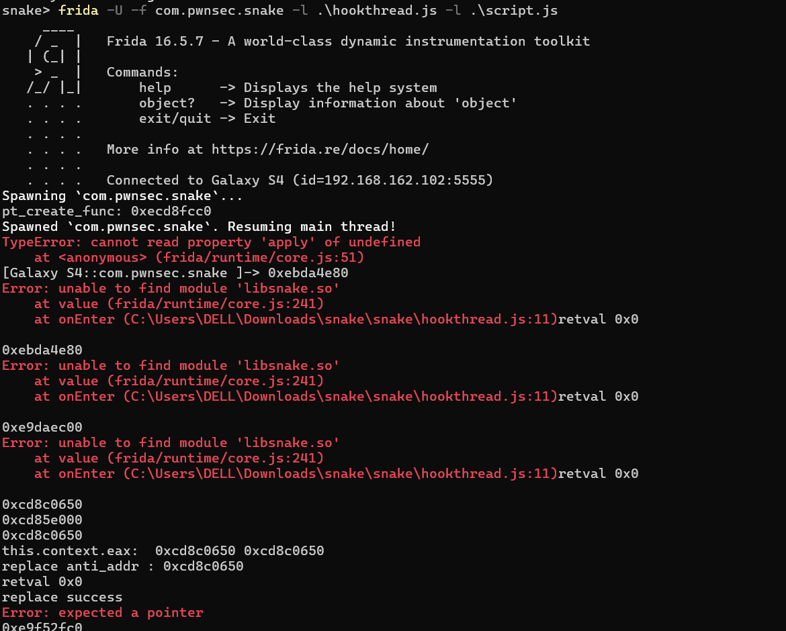

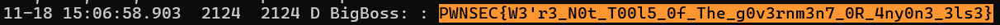

Flag:

```
PWNSEC{W3'r3_N0t_T00l5_0f_The_g0v3rnm3n7_0R_4ny0n3_3ls3}
```

Reference:

https://github.com/xiaokanghub/Android?tab=readme-ov-file#bypass-frida-detection

https://frida.re/docs/javascript-api/

https://www.geeksforgeeks.org/strstr-in-ccpp/