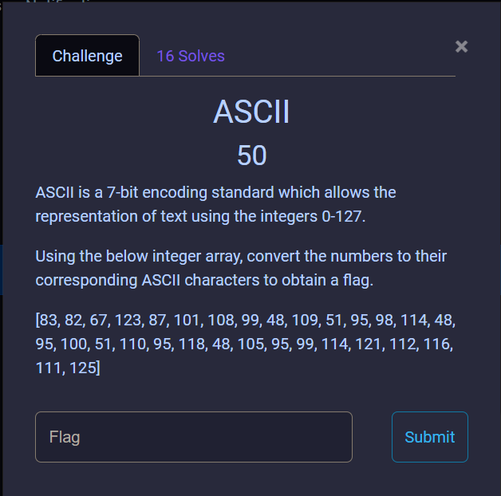
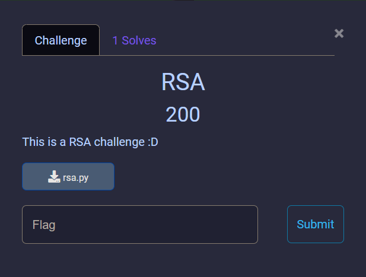

# **CRYPTOGRAPHY WRITE UP**
## **1. ASCII**
**Câu hỏi** 



Với câu hỏi này ta chỉ việc chuyển đổi các con số về các kí tự tương ứng trong bảng mã [ASCII](https://www.asciitable.com/) là sẽ ra kết quả.

Script: [dec.py](./ASCII/dec.py)

**Flag**
```
SRC{Welc0m3_br0_d3n_v0i_crypto}
```
## **2. Ceasar Cipher**
**Câu hỏi**


Source: [cipher.txt](./Caesar%20Cipher/cipher.txt)

Đây là câu hỏi về Ceasar Cipher. Ceasar Cipher là loại mật mã cơ bản. Với key là một số nguyên nào đó, ta thay thế từng kí tự chữ cái trong plain text bằng một kí tự khác cách chữ cái đó trong bảng chữ cái một đoạn bằng k. Mật mã này không khó để giải mã vì số lượng key chỉ có 26, ta chỉ cần thử tất cả trường hợp của key là sẽ giải mã được.

Script: [dec.py](./Caesar%20Cipher/dec.py)

**Flag**
```
SRC{cIph3r_h4p_d4n_h3h3}
```

## **3. Base Encoder**
**Câu hỏi**


**Source**: [base.py](./Base%20Encoder/base.py)

Nhìn vào source code, ta có thể thấy đây là thuật toán của Base64, chỉ khác ở chỗ chuỗi mã hóa được viết theo thứ tự ngược lại rồi thêm dấu bằng phía sau qua câu lệnh ``ret[::-1] + pad``

**Giải thích sơ qua thuật toán base64**:
-   Chuyển từng kí tự trong plaintext về dạng 8-bit. 
-   Thêm các bit 1 vào phía cuối của chuỗi vừa tạo được cho đến khi độ dài của chuỗi chia hết cho 6.
-   Chia chuỗi trên thành các chuỗi nhỏ 6-bit
-   Sử dụng từ điển để chuyển các chuỗi nhỏ 6-bit đó sang các kí tự.
-   Thêm dấu bằng ở cuối chuỗi kí tự đó cho đến khi độ dài của chuỗi đó chia hết cho 4.

Ý tường giải câu hỏi trên: Bỏ dấu bằng rồi đảo ngược lại chuỗi ciphertext. Sau đó base64 decode chúng.

**Script:** [dec.py](./Base%20Encoder/dec.py)

**Flag**
```
SRC{s0m3_cust0m_CRYpt0}
```
## **4. RSA**
**Câu hỏi**



**Source:** [rsa.py](./RSA/rsa.py)

Đây là câu hỏi liên quan đến RSA. Đầu tiên, mình sẽ giới thiệu những điều cơ bản mề mật mã này.

#### **Các tham số cơ bản**
- p và q: Hai số nguyên tố được chọn (thường là rất lớn)
- n = $p*q$: Modulus
- phi: Hàm phi Euler của n $$phi = (p - 1)*(q - 1)$$
- e: Số mũ mã hóa (thường sẽ là 65537)
- d: Số mũ giải mã (là số thỏa mãn điều kiện $e*d \bmod phi = 1$ )
- msg: Message (ở đây là flag)
- c: Message đã được chuyển qua dạng số và đã được mã hóa

#### **Các bước mã hóa cơ bản**
- Chuyển msg về dạng số
```python
flag_enc = flag.encode()
msg = bytes_to_long(flag_enc)
# bytes_to_long lấy từ module Crypto.Util.Number (pip3 install pycryptodome)
```
- Xác định e, tìm p, q và tính n:
```python
e = 65537
p = getprime(512)
q = getprime(512)
n = p*q
```
- Tính c:
```python
c = pow(msg, e, n)
```
#### **Các bước giải mã cơ bản**
- Tìm p,q (mình thường dùng [factordb](http://factordb.com) hoặc [RsaCtfTool](https://github.com/Ganapati/RsaCtfTool) để tìm)
- Tính phi
```python
phi = (p - 1)*(q - 1)
```
- Tính d
```python
d = inverse(e, phi)
# inverse lấy từ module Crypto.Util.number
```
- Tính ra msg (tức là flag) và decode lại
```python
msg = pow(c, d, n)
# đây là cách mình decode
msg_hex = hex(msg)[2:-1]
print(bytes.fromhex(msg_hex).decode('utf-8'))
```
Nhìn vào source code, ta thấy rằng ta đã có 2 bộ public key (e1,c1) và (e2,c2). Vì vậy, ta có thể dùng phương pháp Common modulus (same n) để giải mã mà không cần phải tìm p và q.

Ý tưởng của phương pháp tấn công này (điều kiện là ƯCLN(e1, e2) = 1):
-   Dùng giải thuật Euclid mở rộng để tìm hai số a,b sao cho $$ e_1*a + e_2*b = 1 $$
-   Tính ra msg bằng cách sau $$ msg = msg^1 = msg^{e_1*a + e_2*b} = (msg^{e_1})^a*(msg^{e_2})^b = c_1^a*c_2^b $$

**Script** (mình tham khảo từ https://github.com/HexPandaa/RSA-Common-Modulus-Attack): [dec.py](./RSA/dec.py)

**Flag**
```
SRC{Hello_br0_d4_m0_du0c_RSa}
```